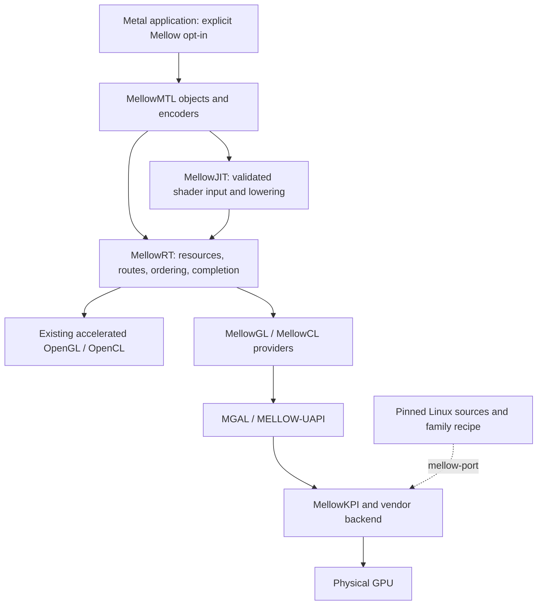

# Mellow

**Metal Emulation Layer Logic for OpenGL/OpenCL Workloads**

Mellow는 Metal 요청을 자체 객체·셰이더 변환·명령 실행 계층으로 처리하고,
가속되는 OpenGL/OpenCL 제공자 또는 향후 native GPU backend에 연결하는 프로젝트입니다.
Metal 2/3의 기능을 단계적으로 구현하고, Linux 드라이버 소스를 활용해 macOS에 드라이버가
없는 GPU까지 확장하는 것이 목표입니다.

현재는 **플랫폼 정책 코드와 소스 포팅 분석 도구를 실행·시험할 수 있는 개발 단계**입니다.
Mellow-owned Metal 장치, 셰이더 JIT, 실제 GL/CL provider와 Linux→XNU GPU driver는 아직
구현되지 않았습니다. RTX 3080·RTX 3090·RX 9070·8086:7D41은 연구 대상이며,
어느 장치도 Mellow Metal 가속 성공으로 표시하지 않습니다.

## 설계의 기준

- [플랫폼 아키텍처](docs/PLATFORM-ARCHITECTURE.md): 각 계층의 소유권, 실행·JIT·포팅 계약과 구현 순서.
- [검토한 설계 결정 / RFC 001](docs/PLATFORM-DECISIONS.md): GL/CL 기능 한계, AIR frontend,
  NVIDIA/Mesa ABI, LinuxKPI, WindowServer 통합의 전제.
- [실제 구현 상태](docs/IMPLEMENTATION-STATUS.md): 구현·미구현·검증 명령의 구분.

작업 중 생성된 CONCEPT, ARCHITECTURE, MGAL, SHADER-JIT 등의 문서는 설계 제안으로
보존합니다. 내용이 충돌하면 위 세 문서와 실제 실행 기록을 우선합니다.
GL/CL 지원은 모든 Metal 기능을 제공한다는 증거가 아니며, GPUCompiler 심볼의 존재는
독립적으로 호출 가능한 MSL frontend가 있다는 증거가 아닙니다.

## 실행 방향



Host 경로는 기존 드라이버가 제공하는 가속을 이용합니다. 드라이버가 없는 GPU는
아래의 kernel/firmware/VM/submission과 사용자 공간 제공자를 먼저 구현해야 합니다.
앱의 offscreen compute/render, IOSurface 전달, 시스템 Metal 등록, WindowServer,
display scanout은 별도 검증 단계입니다.

## 지금 실행할 수 있는 코드

[Runtime/PlatformRuntime.hpp](Runtime/PlatformRuntime.hpp)는 C++17의 독립 정책 계약입니다.

- provider의 advertised/verified 기능과 reset epoch를 확인하여 compute/render/blit 경로를 선택합니다.
- GL↔CL 자원 공유와 명령 순서 또는 명시적 복사를 모두 입증한 계약만 허용합니다.
- CPU reference는 명시적 시험 경로이며 가속 실패의 자동 fallback으로 사용하지 않습니다.
- 오래된 epoch·잘못된 queue/sequence·CPU 결과·불완전한 완료 관측을 거절합니다.
- JIT 캐시 식별에는 소스·entry point·frontend·lowering·backend·driver·target·옵션·
  specialization·resource ABI의 digest가 모두 들어갑니다.

이 코드는 신뢰하는 adapter가 전달한 정보를 검증하는 정책입니다.
실제 GPU 관측을 수집하거나 Metal 셰이더를 컴파일하지 않습니다.

```sh
python3 Tools/run-platform-tests.py --cxx g++ --out build/platform-tests
python3 -m unittest discover -s tests -p test_mellow_port.py -v
```

독립 [OpenCL substrate probe](Tools/probe-opencl-substrate.py)도 제공합니다. 현재 Windows의
Intel OpenCL 드라이버에서 256개 값의 `x * 7 + 3` 연산을 3회 제출하고 readback과 GPU
event timestamp를 확인했습니다. 이 시험은 MellowRT/JIT/Metal을 사용하지 않습니다.
[실행 보고서](validation/opencl-windows-substrate.json)에 OS·드라이버·nonce·결과 hash와
검증 범위를 기록했습니다. 장치 이름으로 7D41 PCI 귀속을 추정하지 않습니다.

```sh
python Tools/probe-opencl-substrate.py --compute --report build/opencl-substrate.json
```

## Linux 소스 포팅 도구

`mellow-port`는 현재 `inspect`, `plan`, `generate`를 지원합니다.
명시적으로 선택한 소스의 SHA256·SPDX·저작권·include/call 목록과 미구현 계약을 기록하고,
지원하는 정수 리터럴 상수만 출처와 함께 추출합니다.
임의 함수를 성공 stub으로 바꾸거나 Linux 바이너리를 kext로 표시하지 않습니다.

```sh
python3 Tools/mellow-port.py generate \
  --source-root /path/to/linux \
  --target xe \
  --revision <full-immutable-commit> \
  --file drivers/gpu/drm/xe/regs/xe_gt_regs.h \
  --output /path/to/new-review-output \
  --require-ready
```

`--target`은 `xe`, `amdgpu`, `nvidia-open`입니다. 현재 `--require-ready`는
보고서를 만든 뒤 exit 2를 반환합니다. 이는 아직 실제 XNU GPU driver를 빌드할 수 없기
때문입니다. 일반 exit 0은 검토 산출물 생성 성공만 뜻합니다.
`--revision`은 입력된 출처 표기이며, 파일별 content hash 측정과 commit 귀속 검증은 다릅니다.

장기 목표는 검토·구현한 GPU family recipe에 Linux 소스를 넣으면 변환·빌드·회귀 검증이
재현되는 작업 흐름입니다. 첫 family의 메모리·동기화·펌웨어·userspace ABI 구현을
자동 변환이라는 이름으로 생략하지 않습니다.
[NVIDIA 공개 모듈](https://github.com/NVIDIA/open-gpu-kernel-modules)은 대응 GSP와 userspace가
필요하며, NVIDIA RM과 Nouveau/Mesa winsys의 ABI는 별도입니다.

## 기존 연구 자산과 검증 범위

`Mellow/`의 Lilu/Xe 코드는 이전 연구 경로로 유지됩니다. 새 Runtime은 현재 kext에
연결되지 않으며 이 개편이 Galaxy Book EFI에 GPU 드라이버를 활성화하지 않습니다.

- [기존 native backend 감사](docs/NATIVE-XE-BACKEND-AUDIT.md)
- [실제 kext 빌드 기록](docs/BUILD-VALIDATION.md)
- [실기 compute/render/stress 수용 기준](docs/ACCEPTANCE-0.4.1.ko.md)
- [기존 ABI 조사](docs/TAHOE-ABI.md), [Intel OpenCL 컴파일 산출물](compiler-evidence/)

기존 validation 파일은 각 파일에 기록된 버전과 실험의 증거입니다.
호스트 정책 테스트와 소스 분석 통과는 GPU 가속·설치·WindowServer 통과로 승격하지 않습니다.

## Attribution and license

기존 [LICENSE](LICENSE), [NOTICE](NOTICE), [LICENSES](LICENSES)를 유지합니다.
Mellow/NootedGreen 유래 코드와 Linux·Mesa·vendor 소스는 각 원래 조건을 따릅니다.
소스 자동 추출은 라이선스 호환성 승인이 아니며, 전체 dependency closure를 파일별로 검토합니다.
Apple 운영체제·컴파일러나 vendor firmware의 재배포 허가는 소스 공개 여부에서 추정하지 않습니다.
