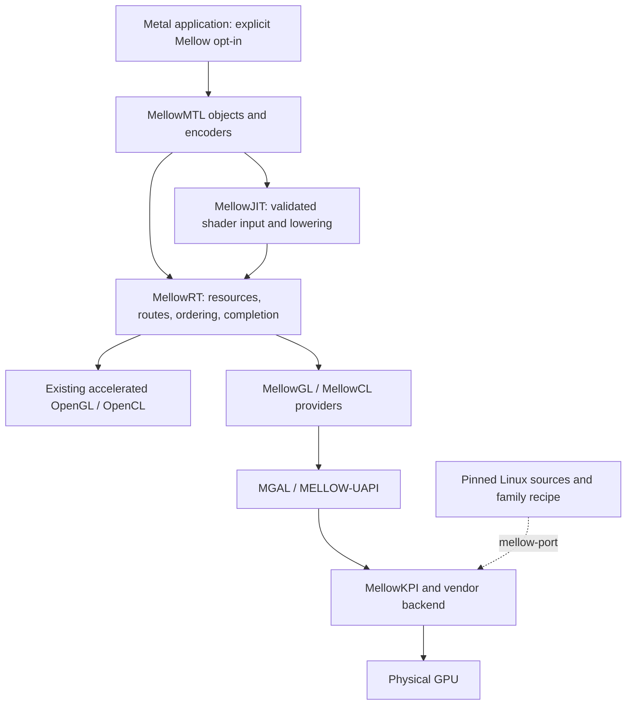

# Mellow

**Metal Emulation Layer Logic for OpenGL/OpenCL Workloads**

Mellow는 Metal 요청을 자체 객체·셰이더 변환·명령 실행 계층으로 처리하고,
가속되는 OpenGL/OpenCL 제공자 또는 향후 native GPU backend에 연결하는 프로젝트입니다.
Metal 2/3의 기능을 단계적으로 구현하고, Linux 드라이버 소스를 활용해 macOS에 드라이버가
없는 GPU까지 확장하는 것이 목표입니다.

현재는 **자체 C++ 객체와 제한된 compute·render 셰이더 변환을 실제 GPU에서 실행하는 개발 단계**입니다.
Windows Intel GPU에서 MSL과 raw AIR 각각 10,000회 제출·readback을 검증했습니다.
Device·Buffer·Library·Function·Pipeline·Queue·CommandBuffer·Encoder를 구현했고,
MSL 타입 AST 또는 실제 LLVM으로 디코딩한 AIR SSA를 OpenCL C로 변환한 뒤 드라이버가 컴파일합니다.
렌더링은 별도 RenderDevice에서 MSL vertex/fragment를 GLSL로 변환하고 실제 WGL/OpenGL
program을 재사용합니다. 1,000회 offscreen 렌더링의 3,072,000픽셀과 visible window
120회의 368,640픽셀을 독립적으로 검증했습니다. 창 swap API 성공은 물리 scanout 검증과 구분합니다.
Linux Xe 원본 함수는 kext 메모리 경로에 연결되어 있으며, Mellow.kext 0.4.3에는
명시적으로 켜는 Tahoe PCI·IOUserClient·DMA 진단 경로도 포함했습니다.
Apple Objective-C Metal ABI, 전체 Metal 2/3, native Tahoe GPU 실행·WindowServer 가속은 구현·검증이 남아 있습니다.
RTX 3080·RTX 3090·RX 9070·8086:7D41 중 어느 장치도 Mellow Metal 가속 성공으로 표시하지 않습니다.

## 설계의 기준

- [플랫폼 아키텍처](docs/PLATFORM-ARCHITECTURE.md): 각 계층의 소유권, 실행·JIT·포팅 계약과 구현 순서.
- [검토한 설계 결정 / RFC 001](docs/PLATFORM-DECISIONS.md): GL/CL 기능 한계, AIR frontend,
  NVIDIA/Mesa ABI, LinuxKPI, WindowServer 통합의 전제.
- [실제 구현 상태](docs/IMPLEMENTATION-STATUS.md): 구현·미구현·검증 명령의 구분.
- [MSL/AIR 객체·JIT·Tahoe 진단 통합 검증](docs/VERIFICATION-METAL-JIT-2026-09-06.md): 최신 실행 증거.
- [MSL 렌더링 구현 계약](docs/RENDER-IMPLEMENTATION.md): 실제 렌더 객체·셰이더·픽셀 검증 범위.
- [렌더링 실기 증거와 source hash 감사](validation/render/integration.json):
  [offscreen 1,000회](validation/render/objects-offscreen.json),
  [visible 120회](validation/render/objects-visible.json), [실제 GPU readback](validation/render/offscreen-gpu-readback.png).
- [드라이버 이식·실제 GPU·QEMU 검증 기록](docs/VERIFICATION-2026-09-06.md): 환경별 실행과 남은 관문.

작업 중 생성된 CONCEPT, ARCHITECTURE, MGAL, SHADER-JIT 등의 문서는 설계 제안으로
보존합니다. 내용이 충돌하면 위 세 문서와 실제 실행 기록을 우선합니다.
GL/CL 지원은 모든 Metal 기능을 제공한다는 증거가 아니며, GPUCompiler 심볼의 존재는
독립적으로 호출 가능한 MSL frontend가 있다는 증거가 아닙니다.

## 실행 방향



Host 경로는 기존 드라이버가 제공하는 가속을 이용합니다. 드라이버가 없는 GPU는
아래의 kernel/firmware/VM/submission과 사용자 공간 제공자를 먼저 구현해야 합니다.
앱의 offscreen compute/render, IOSurface 전달, 시스템 Metal 등록, WindowServer,
display scanout은 별도 검증 단계입니다.

## 지금 실행할 수 있는 코드

[Runtime/MetalObjects.md](Runtime/MetalObjects.md)는 앱이 명시적으로 선택하는 C++ API입니다.
[Examples/compute-msl.cpp](Examples/compute-msl.cpp)는 MSL의 `x[i] * 7u + 3u`를 실제 GPU에
제출하며 현재 Windows 실행에서 `10 17 24 31`을 반환했습니다. 기존 앱의 Metal framework를
교체하거나 시스템 `MTLDevice`를 등록하는 API는 아닙니다.

[Examples/render-msl.cpp](Examples/render-msl.cpp)는 별도의 RenderDevice·RenderTexture·
RenderLibrary·RenderPipeline·RenderEncoder를 사용하는 그래픽 클라이언트입니다.
현재는 RGBA8 attachment에 단일 삼각형을 그리는 MSL vertex/fragment 부분집합을 지원합니다.
fragment position과 top-left readback, 공유 float4 파라미터, 실제 fence와 완료 상태를 검사하며
라이브러리/함수/파이프라인의 소유권을 유지합니다. GL/CL 자원 공유와 sampled texture는 지원하지 않습니다.

```powershell
python Tools/run-render-objects.py --cxx C:/msys64/mingw64/bin/g++.exe --out build/msl-render --render --frames 1000
python Tools/run-render-objects.py --cxx C:/msys64/mingw64/bin/g++.exe --out build/msl-render-visible --render --visible --frames 120
```

이 runner는 실제 GPU의 전체 RGBA 스트림과 마지막 frame PNG를 저장합니다. Python이 별도로
삼각형 coverage와 gradient를 계산하며, 경계 픽셀도 제한된 subpixel 범위에서 clear 또는
올바른 fragment 색상만 허용합니다. 일반 런타임에는 픽셀 정답을 전달하지 않습니다.
실제 GPU가 없는 환경에서는 `--render`를 생략해 컴파일만 검사합니다. Linux의 native GL
실행은 명시적으로 unsupported이며, CI의 frontend·빌드·보고서 검사는 GPU 실행 증거가 아닙니다.

```powershell
python Tools/run-metal-objects.py --cxx C:/msys64/mingw64/bin/g++.exe --out build/msl-objects --compute --iterations 10000
python Tools/run-metal-objects.py --cxx C:/msys64/mingw64/bin/g++.exe --out build/air-objects --compute --iterations 10000 --air-bitcode tests/fixtures/air/synthetic-uint-affine.bc --entry air_affine --llvm-library C:/path/to/LLVM-C.dll
```

AIR 입력은 고정된 ABI의 uint 단일 버퍼 compute 부분집합입니다. 위 양성 fixture는 직접 작성한
**synthetic 입력**이며, 실제 LLVM 검증·GPU 실행을 통과해도 일반 Apple 산출물 호환성을 뜻하지 않습니다.
지원 범위는 [셰이더 계약](docs/SHADER-JIT-IMPLEMENTATION.md), 비트코드·컨테이너 입력은
[AIR decoder](docs/AIR-DECODER.md)를 따릅니다. LLVM 라이브러리는 별도로 준비해야 합니다.

[Runtime/PlatformRuntime.hpp](Runtime/PlatformRuntime.hpp)는 C++17의 독립 정책 계약입니다.

- provider의 advertised/verified 기능과 reset epoch를 확인하여 compute/render/blit 경로를 선택합니다.
- GL↔CL 자원 공유와 명령 순서 또는 명시적 복사를 모두 입증한 계약만 허용합니다.
- CPU reference는 명시적 시험 경로이며 가속 실패의 자동 fallback으로 사용하지 않습니다.
- 오래된 epoch·잘못된 queue/sequence·CPU 결과·불완전한 완료 관측을 거절합니다.
- JIT 캐시 식별에는 소스·entry point·frontend·lowering·backend·driver·target·옵션·
  specialization·resource ABI의 digest가 모두 들어갑니다.

이 정책 코드 자체는 GPU 관측을 수집하거나 셰이더를 컴파일하지 않습니다.
[OpenCLProvider](Runtime/OpenCLProvider.md)가 실제 context·queue·event·buffer를 소유하고
관측을 수집합니다. provider가 직접 받는 입력은 `OpenClC`입니다. Mellow 객체 계층은 검증한
MSL/AIR 부분집합만 번역하여 이 경로에 전달하며, 범용 Metal capability를 선언하지 않습니다.

```sh
python3 Tools/run-platform-tests.py --cxx g++ --out build/platform-tests
python3 -m unittest discover -s tests -p test_mellow_port.py -v
```

독립 [OpenCL substrate probe](Tools/probe-opencl-substrate.py)도 제공합니다. 현재 Windows의
Intel OpenCL 드라이버에서 256개 값의 `x * 7 + 3` 연산을 3회 제출하고 readback과 GPU
event timestamp를 확인했습니다. 이 시험은 MellowRT/JIT/Metal을 사용하지 않습니다.
[실행 보고서](validation/opencl-windows-substrate.json)에 OS·드라이버·nonce·결과 hash와
검증 범위를 기록했습니다. 장치 이름으로 7D41 PCI 귀속을 추정하지 않습니다.

```sh
python Tools/probe-opencl-substrate.py --compute --report build/opencl-substrate.json
```

위 독립 probe에서 발전한 실제 C++ runtime 경로는 다음과 같습니다. Windows 예시이며
GPU가 없는 CI에서는 `--compute`를 생략해 컴파일만 수행합니다.

```powershell
python Tools/run-opencl-runtime.py --cxx C:/msys64/mingw64/bin/g++.exe --out build/opencl-runtime --compute
```

실제 Windows 시험에서는 `--iterations 10000 --timeout 180`으로 연속 10,000회,
총 2,560,000개 결과를 검증했습니다. 모든 제출의 event·readback·완료·자원 해제를 확인하고
전체 스트림 hash를 Python의 독립 계산과 대조했습니다. 이 결과는 OpenCL C 실행이며
Metal 또는 이식한 Darwin backend의 실기 실행 결과는 아닙니다.

드라이버가 보고한 `cl_intel_device_attribute_query` 확장을 확인한 뒤 장치 ID를 조회합니다.
현재 시험에서는 `8086:7D41`을 반환했습니다. 물리 PCI 소유권이나 Tahoe 드라이버 검증으로
승격하지 않으며, 관측할 수 없는 reset/page-fault 수치를 0으로 만들지 않습니다.

## Linux 소스 포팅 도구

`mellow-port`는 현재 `inspect`, `plan`, `generate`를 지원합니다.
명시적으로 선택한 소스의 SHA256·SPDX·저작권·include/call 목록과 미구현 계약을 기록하고,
지원하는 정수 리터럴 상수만 출처와 함께 추출합니다.
임의 함수를 성공 stub으로 바꾸거나 Linux 바이너리를 kext로 표시하지 않습니다.

```sh
python3 Tools/mellow-port.py generate \
  --source-root /path/to/linux \
  --target xe \
  --revision <full-immutable-commit> \
  --file drivers/gpu/drm/xe/regs/xe_gt_regs.h \
  --output /path/to/new-review-output \
  --require-ready
```

`--target`은 `xe`, `amdgpu`, `nvidia-open`입니다. 현재 `--require-ready`는
보고서를 만든 뒤 exit 2를 반환합니다. 이는 아직 실제 XNU GPU driver를 빌드할 수 없기
때문입니다. 일반 exit 0은 검토 산출물 생성 성공만 뜻합니다.
`--revision`은 입력된 출처 표기이며, 파일별 content hash 측정과 commit 귀속 검증은 다릅니다.

장기 목표는 검토·구현한 GPU family recipe에 Linux 소스를 넣으면 변환·빌드·회귀 검증이
재현되는 작업 흐름입니다. 첫 family의 메모리·동기화·펌웨어·userspace ABI 구현을
자동 변환이라는 이름으로 생략하지 않습니다.
[NVIDIA 공개 모듈](https://github.com/NVIDIA/open-gpu-kernel-modules)은 대응 GSP와 userspace가
필요하며, NVIDIA RM과 Nouveau/Mesa winsys의 ABI는 별도입니다.

[Drivers/PortedXe](Drivers/PortedXe/PORTING-NOTES.md)는 분석 도구와 별개인 실제 수동 부분 이식입니다.
고정 Linux commit의 원본 함수 6개, SG 기반 GGTT bind/unmap과 명시적인 pin·invalidation 계약을
컴파일·실행합니다. 기존 XeMemory의 PPGTT/PDE 함수도 이 코드를 호출합니다.
호스트와 QEMU에서 각각 18,721개 검사를 통과했지만 MMIO/DMA 경계는 시험 모델입니다.
이 부분 이식은 임의 Linux driver를 완성된 kext로 자동 변환한다는 뜻이 아닙니다.

## 기존 연구 자산과 검증 범위

`Mellow/`의 Lilu/Xe 연구 경로에는 새 PortedXe PTE/PDE 인코더를 연결했습니다.
기존 46비트 DMA·4 KiB system-memory·read-only 계약을 유지하고, kext 0.4.3의
33개 대상 소스를 실제 Darwin linker로 빌드했습니다. 새 진단 서비스의 IOUserClient는
관리자에게 query·bounded DMA 준비·해제만 제공하며 GuC/GPU 제출은 제공하지 않습니다.
426개 import의 정적 Tahoe export 대응을 확인했습니다. 사용자 공간 MellowRT는 별도입니다.
구조 검증은 실제 Tahoe 적재·GuC·GPU 실행을 입증하지 않으며, 이 변경을 USB EFI에
자동 활성화하지 않았습니다.

- [기존 native backend 감사](docs/NATIVE-XE-BACKEND-AUDIT.md)
- [실제 kext 빌드 기록](docs/BUILD-VALIDATION.md)
- [Tahoe 진단 드라이버 계약과 실기 명령](docs/TAHOE-DRIVER-IMPLEMENTATION.md)
- [실기 compute/render/stress 수용 기준](docs/ACCEPTANCE-0.4.1.ko.md)
- [기존 ABI 조사](docs/TAHOE-ABI.md), [Intel OpenCL 컴파일 산출물](compiler-evidence/)

기존 validation 파일은 각 파일에 기록된 버전과 실험의 증거입니다.
호스트 정책 테스트와 소스 분석 통과는 GPU 가속·설치·WindowServer 통과로 승격하지 않습니다.

## Attribution and license

기존 [LICENSE](LICENSE), [NOTICE](NOTICE), [LICENSES](LICENSES)를 유지합니다.
Mellow/NootedGreen 유래 코드와 Linux·Mesa·vendor 소스는 각 원래 조건을 따릅니다.
소스 자동 추출은 라이선스 호환성 승인이 아니며, 전체 dependency closure를 파일별로 검토합니다.
Apple 운영체제·컴파일러나 vendor firmware의 재배포 허가는 소스 공개 여부에서 추정하지 않습니다.
