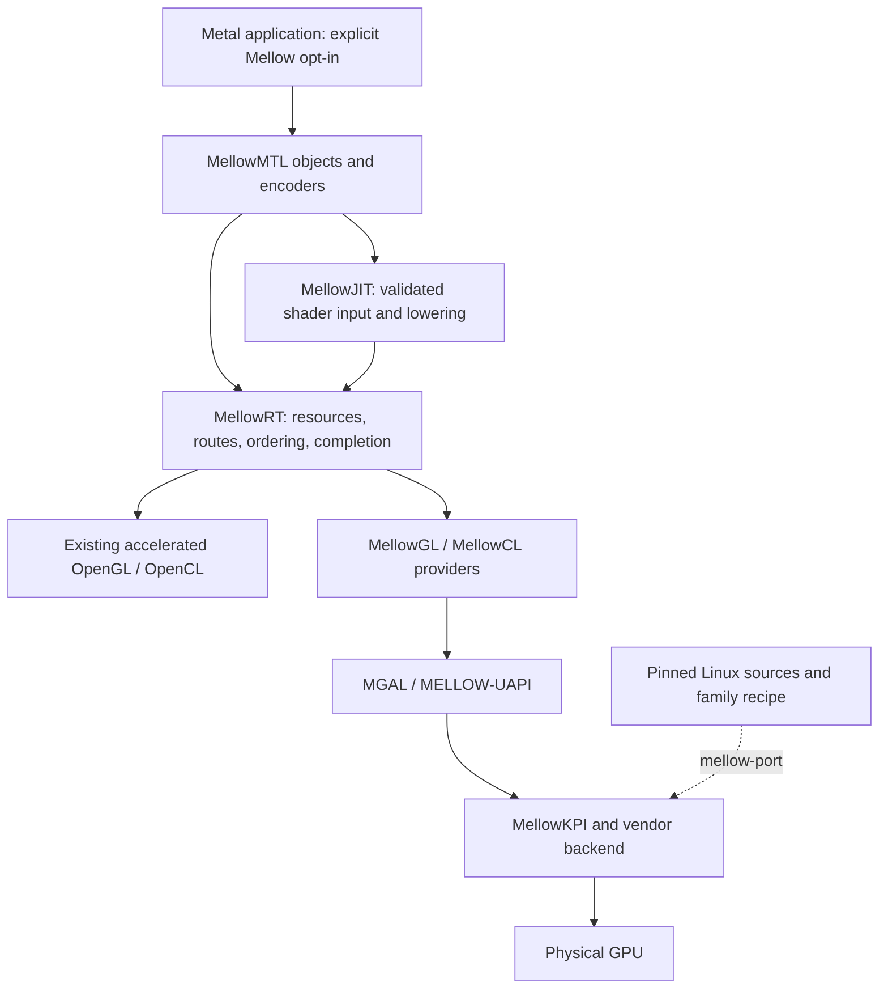

# Mellow.kext — 그래픽 기기별 개발 완성도

**Metal Emulation Layer Logic for OpenGL/OpenCL Workloads**

**현재 Mellow의 native macOS GPU 실행·Metal·WindowServer를 실기로 검증해 지원 완료한 기기는 없습니다.**
아래 표는 2026-09-30 기준 저장소의 구현과 검증 기록을 나타냅니다.
전체 개발 목표는 macOS 드라이버가 없는 Intel·NVIDIA 기기의 native GPU 드라이버,
Metal 2/3, WindowServer·디스플레이 통합과 안정성 검증까지 완성하는 것입니다.

## 기기별 현재 단계

**부분 구현**은 일부 코드의 구현과 빌드 또는 호스트 검사 기록이 있는 단계입니다.
**식별 테이블**은 기기 ID를 인식하는 코드만 있는 단계이며,
**소스 검토 도구**는 원본 파일의 경로·출처·미구현 항목을 기록하는 도구가 있는 단계입니다.
어느 표현도 해당 기기의 macOS 가속 지원 완료를 뜻하지 않습니다.

| 기기 / PCI ID | 현재 개발 단계 | Mellow에 있는 구현과 남은 작업 | native macOS GPU·Metal·WindowServer 실기 결과 |
| --- | --- | --- | --- |
| **Intel `8086:7D41`** — 저장소 식별명: Arrow Lake-U Intel Graphics 4-Core | **부분 구현 · 빌드 기록 있음** | Xe 메모리·GuC·제출/fence/readback·IOKit 연결 소스가 있음. 실제 PCI·펌웨어·VM·context를 소유하고 서비스를 등록하는 통합 드라이버는 미완성 | **모두 미검증 · 지원 완료 전** |
| Intel `8086:7D40` — Intel Graphics (Meteor Lake) | **식별 테이블 단계** | [기기 식별 코드](Mellow/kern_model.hpp)에 ID가 있음. 기기별 native 실행·firmware·display 검증은 없음 | **모두 미검증** |
| Intel `8086:7D45` — Intel Graphics (Meteor Lake) | **식별 테이블 단계** | 기기 ID 인식 코드가 있음. 해당 실물의 실행·display 기록 없음 | **모두 미검증** |
| Intel `8086:7D55` — Intel Arc Graphics (Meteor Lake) | **식별 테이블 단계** | 기기 ID 인식 코드가 있음. 해당 실물의 실행·display 기록 없음 | **모두 미검증** |
| Intel `8086:7DD5` — Intel Graphics (Meteor Lake) | **식별 테이블 단계** | 기기 ID 인식 코드가 있음. 해당 실물의 실행·display 기록 없음 | **모두 미검증** |
| Intel `8086:7D51` — Intel Graphics (Arrow Lake-H) | **식별 테이블 단계** | 기기 ID 인식 코드가 있음. 해당 실물의 실행·display 기록 없음 | **모두 미검증** |
| Intel `8086:7D67` — Intel Graphics (Arrow Lake-S) | **식별 테이블 단계** | 기기 ID 인식 코드가 있음. 해당 실물의 실행·display 기록 없음 | **모두 미검증** |
| 기타 Intel — `i915` / `xe` 검토 대상 | **소스 검토 도구 단계** | 계열·PCI ID별 backend 구현과 실기 수용이 필요. `7D41` 구현을 다른 기기에 그대로 적용할 수 없음 | **기기별 지원 근거 없음** |
| **NVIDIA GeForce RTX 3080** — Ampere / GA102 | **커맨드 패킷 부분 구현** | AmpereA 형식의 GPFIFO·메서드 패킷 인코더가 있음. 실물 채널 연결·GPUVM·firmware·제출·display는 미구현 | **실기 기록 없음 · 지원 미완료** |
| **NVIDIA GeForce RTX 3090** — Ampere / GA102 | **커맨드 패킷 부분 구현** | AmpereA 형식의 패킷 인코더가 있음. 해당 실물의 GPU 소유권·사용자 공간 driver 연결은 미구현 | **실기 기록 없음 · 지원 미완료** |
| **NVIDIA GeForce RTX 4080** — Ada / AD103 | **공통 패킷 부분 구현·외부 소스 참고** | Ada의 Ampere 상속을 조사함. 실제 채널 클래스 선택과 Mellow driver·Metal plugin 통합은 미구현 | **Mellow 실기 기록 없음 · 지원 미완료** |

`7D41`의 새 native 커널 소스 4개와 기존 XeContextExecution은 Darwin24/25용
총 10개 Mach-O 객체로 컴파일됐습니다. [native GPU 소스 검증 기록](validation/native-gpu/source-checkpoint.json)에는
GuC transport 105,180회·context execution 483회 sanitizer 호스트 검사도 있습니다.
이 기록의 GPU callback은 시험 모델이며 `gpu_execution=false`입니다.
기존 kext의 부분 이식·진단 빌드와 별도로 기록하며, 새 전체 kext 링크·적재·실기 실행을 뜻하지 않습니다.
앱이 명시적으로 선택하는 [macOS compute/render·IOSurface 창 표시 소스](docs/NATIVE-METAL-WINDOW-PATH.md)도
있지만 Apple 사용자 공간 SDK 빌드와 실제 macOS 실행은 아직 검증되지 않았습니다.
Ice Lake 호환성 연구 경로는 실기 미검증이고 Tiger Lake 경로는 폐기 예정(`DEPRECATED`)입니다.
기기 이름·ID 등록·Recovery 입력에 있는 framebuffer만으로 macOS 버전별 지원을 추정하지 않습니다.

### NVIDIA 계열별 포팅 범위

다음은 **패킷 인코더의 구현 범위와 소스 검토 경로**입니다.
인코더는 명령 데이터를 구성하며 GPU에 제출하지 않습니다.

| NVIDIA 계열 | 구현된 패킷 소스 | 현재 소스 검토 경로 | native GPU driver·Metal·WindowServer |
| --- | --- | --- | --- |
| Maxwell | MaxwellA 형식 GPFIFO·메서드 인코더 | `nouveau` 검토; `nvidia-open` 실행 대상 아님 | **통합 드라이버 미구현 · 실기 미검증** |
| Pascal | PascalA 형식 GPFIFO·메서드 인코더 | `nouveau` 검토; `nvidia-open` 실행 대상 아님 | **통합 드라이버 미구현 · 실기 미검증** |
| Volta | VoltaA 형식 GPFIFO·메서드 인코더 | `nouveau` 등 별도 경로; `nvidia-open` 실행 대상 아님 | **통합 드라이버 미구현 · 실기 미검증** |
| Turing | TuringA 형식 GPFIFO·메서드 인코더 | `nvidia-open` / `nouveau` 검토 도구 | **통합 드라이버 미구현 · 실기 미검증** |
| Ampere | AmpereA 형식 GPFIFO·메서드 인코더 | `nvidia-open` / `nouveau`; RTX 3080/3090 연구 대상 | **통합 드라이버 미구현 · 실기 미검증** |
| Ada | upstream의 Ampere 상속 조사; Ada 전용 클래스 별칭 없음 | `nvidia-open` / `nouveau`; RTX 4080 외부 소스 참고 | **실물 채널 연결·통합 드라이버 미구현 · 실기 미검증** |
| Hopper | HopperA 형식·extended-base/fetch 쌍·메서드 인코더 | `nvidia-open` 검토 도구 | **통합 드라이버 미구현 · 실기 미검증** |
| Blackwell | BlackwellA/B 두 형식·extended-base/fetch 쌍·메서드 인코더 | `nvidia-open` 검토 도구 | **통합 드라이버 미구현 · 실기 미검증** |

[PortedNvidia](Drivers/PortedNvidia/PORTING-NOTES.md)는 위 8개 채널 형식의 패킷 구성 코드입니다.
[호스트 sanitizer 검사 **131,616회**](validation/native-gpu/source-checkpoint.json)를 통과했으며,
범위는 패킷 값·경계·오류 처리입니다.
실제 GPUVM·firmware·채널 소유권·ring 제출·GPU 완료·reset·display 구현과 실기 실행은 아직 없습니다.
형식 이름은 기기를 탐지하거나 해당 GPU의 지원을 승인하는 값이 아닙니다.

[NVIDIA 공개 모듈의 대상은 Turing 이상](https://github.com/NVIDIA/open-gpu-kernel-modules#compatible-gpus)이며,
대응하는 GSP firmware·사용자 공간 드라이버 버전이 필요합니다. 이는 Linux 원본의 범위입니다.
Mellow의 [recipe 설정](porting/backend-recipes.json)은 모든 경로에서 PCI ID 목록이 비어 있고,
검토 산출물은 `driver_ready=false`를 유지합니다. `nouveau` 경로도 특정 기기의 firmware·성능·macOS 지원을 보증하지 않습니다.
[OpenNVDA의 RTX 4080 기록](https://github.com/bdwithganesh/OpenNVDA/blob/2044adc11ceea642b2798b1943c292891562ae2b/README.md)은
외부 프로젝트 작성자의 관측입니다. Mellow에서 재현한 결과나 RTX 3080/3090의 지원 증거로 사용하지 않습니다.

### 별도로 검증된 Windows 경로

아래 결과는 **설치된 Intel Windows 드라이버를 이용한 Mellow 사용자 공간 부분집합**입니다.
이식한 Darwin driver나 Apple의 시스템 Metal·WindowServer를 실행한 결과는 아닙니다.

| 실행 경로 | 기록된 결과 | 기기 귀속과 검증 한계 |
| --- | --- | --- |
| MSL compute → OpenCL | [10,000회 GPU 제출·독립 readback](validation/msl-object-gpu.json) | Intel Windows 드라이버 사용. 물리 PCI 소유권 독립 검증 없음 |
| synthetic raw AIR compute → OpenCL | [10,000회 GPU 제출·독립 readback](validation/air-object-gpu.json) | 직접 작성한 AIR fixture의 제한된 부분집합. 일반 Apple 산출물 호환성 증거 아님 |
| MSL vertex/fragment → WGL/OpenGL | [offscreen 1,000회·visible 120회, 전체 픽셀 대조](validation/render/integration.json) | `Intel(R) Graphics` renderer 관측. 이 문자열로 `7D41`을 추정하지 않으며 swap 성공은 물리 scanout 증거 아님 |
| 직접 OpenCL C → MellowRT provider | [10,000회·2,560,000개 결과 대조](validation/native-opencl-runtime.json) | OpenCL 확장이 `8086:7D41`을 보고했지만 물리 PCI 소유권·macOS 실행은 미검증 |

추가 연구 대상인 **AMD RX 9070**은 `amdgpu` 소스 검토 도구 단계이며 native backend·Metal·WindowServer는
미구현·미검증입니다. 현재 Intel·NVIDIA 개발 대상과 분리해 기록합니다.

> **Sequoia 255U 개발 브랜치:** 실험용 EFI와 Mellow 0.4.4를 다룹니다. 대상 실물의 boot·GPU 실행과 전체 Metal 지원은 아직 검증되지 않았습니다. [EFI 전달 상태](docs/SEQUOIA-255U.md), [한글 EFI 설명](EFI-255U/README-FIRST.ko.md)을 참조하세요.

## 설계의 기준

- [플랫폼 아키텍처](docs/PLATFORM-ARCHITECTURE.md): 각 계층의 소유권, 실행·JIT·포팅 계약과 구현 순서.
- [검토한 설계 결정 / RFC 001](docs/PLATFORM-DECISIONS.md): GL/CL 기능 한계, AIR frontend,
  NVIDIA/Mesa ABI, LinuxKPI, WindowServer 통합의 전제.
- [실제 구현 상태](docs/IMPLEMENTATION-STATUS.md): 구현·미구현·검증 명령의 구분.
- [native GPU 경계](docs/NATIVE-GPU-BOUNDARY.md), [계열별 소스 검토 경로](docs/GPU-FAMILY-SOURCE-INTAKE.md):
  현재 kernel/user 통신과 Intel·NVIDIA 포팅의 남은 구현.
- [MSL/AIR 객체·JIT·Tahoe 진단 통합 검증](docs/VERIFICATION-METAL-JIT-2026-09-06.md): Windows 부분집합과 기존 진단 검증 기록.
- [MSL 렌더링 구현 계약](docs/RENDER-IMPLEMENTATION.md): 실제 렌더 객체·셰이더·픽셀 검증 범위.
- [렌더링 실기 증거와 source hash 감사](validation/render/integration.json):
  [offscreen 1,000회](validation/render/objects-offscreen.json),
  [visible 120회](validation/render/objects-visible.json), [실제 GPU readback](validation/render/offscreen-gpu-readback.png).
- [드라이버 이식·실제 GPU·QEMU 검증 기록](docs/VERIFICATION-2026-09-06.md): 환경별 실행과 남은 관문.

작업 중 생성된 CONCEPT, ARCHITECTURE, MGAL, SHADER-JIT 등의 문서는 설계 제안으로
보존합니다. 내용이 충돌하면 위 세 문서와 실제 실행 기록을 우선합니다.
GL/CL 지원은 모든 Metal 기능을 제공한다는 증거가 아니며, GPUCompiler 심볼의 존재는
독립적으로 호출 가능한 MSL frontend가 있다는 증거가 아닙니다.

## 실행 방향


```mermaid
flowchart TD
  App[Metal application: explicit Mellow opt-in] --> MTL[MellowMTL objects and encoders]
  MTL --> JIT[MellowJIT: validated shader input and lowering]
  MTL --> RT[MellowRT: resources, routes, ordering, completion]
  JIT --> RT
  RT --> Host[Existing accelerated OpenGL / OpenCL]
  RT --> Mesa[MellowGL / MellowCL providers]
  Mesa --> MGAL[MGAL / MELLOW-UAPI]
  MGAL --> Port[MellowKPI and vendor backend]
  Port --> GPU[Physical GPU]
  Linux[Pinned Linux sources and family recipe] -.mellow-port.-> Port
```

Host 경로는 기존 드라이버가 제공하는 가속을 이용합니다. 드라이버가 없는 GPU는
아래의 kernel/firmware/VM/submission과 사용자 공간 제공자를 먼저 구현해야 합니다.
앱의 offscreen compute/render, IOSurface 전달, 시스템 Metal 등록, WindowServer,
display scanout은 별도 검증 단계입니다.

## 지금 실행할 수 있는 코드

[Runtime/MetalObjects.md](Runtime/MetalObjects.md)는 앱이 명시적으로 선택하는 C++ API입니다.
[Examples/compute-msl.cpp](Examples/compute-msl.cpp)는 MSL의 `x[i] * 7u + 3u`를 실제 GPU에
제출하며 현재 Windows 실행에서 `10 17 24 31`을 반환했습니다. 기존 앱의 Metal framework를
교체하거나 시스템 `MTLDevice`를 등록하는 API는 아닙니다.

[Examples/render-msl.cpp](Examples/render-msl.cpp)는 별도의 RenderDevice·RenderTexture·
RenderLibrary·RenderPipeline·RenderEncoder를 사용하는 그래픽 클라이언트입니다.
현재는 RGBA8 attachment에 단일 삼각형을 그리는 MSL vertex/fragment 부분집합을 지원합니다.
fragment position과 top-left readback, 공유 float4 파라미터, 실제 fence와 완료 상태를 검사하며
라이브러리/함수/파이프라인의 소유권을 유지합니다. GL/CL 자원 공유와 sampled texture는 지원하지 않습니다.

```powershell
python Tools/run-render-objects.py --cxx C:/msys64/mingw64/bin/g++.exe --out build/msl-render --render --frames 1000
python Tools/run-render-objects.py --cxx C:/msys64/mingw64/bin/g++.exe --out build/msl-render-visible --render --visible --frames 120
```

이 runner는 실제 GPU의 전체 RGBA 스트림과 마지막 frame PNG를 저장합니다. Python이 별도로
삼각형 coverage와 gradient를 계산하며, 경계 픽셀도 제한된 subpixel 범위에서 clear 또는
올바른 fragment 색상만 허용합니다. 일반 런타임에는 픽셀 정답을 전달하지 않습니다.
실제 GPU가 없는 환경에서는 `--render`를 생략해 컴파일만 검사합니다. Linux의 native GL
실행은 명시적으로 unsupported이며, CI의 frontend·빌드·보고서 검사는 GPU 실행 증거가 아닙니다.

```powershell
python Tools/run-metal-objects.py --cxx C:/msys64/mingw64/bin/g++.exe --out build/msl-objects --compute --iterations 10000
python Tools/run-metal-objects.py --cxx C:/msys64/mingw64/bin/g++.exe --out build/air-objects --compute --iterations 10000 --air-bitcode tests/fixtures/air/synthetic-uint-affine.bc --entry air_affine --llvm-library C:/path/to/LLVM-C.dll
```

AIR 입력은 고정된 ABI의 uint 단일 버퍼 compute 부분집합입니다. 위 양성 fixture는 직접 작성한
**synthetic 입력**이며, 실제 LLVM 검증·GPU 실행을 통과해도 일반 Apple 산출물 호환성을 뜻하지 않습니다.
지원 범위는 [셰이더 계약](docs/SHADER-JIT-IMPLEMENTATION.md), 비트코드·컨테이너 입력은
[AIR decoder](docs/AIR-DECODER.md)를 따릅니다. LLVM 라이브러리는 별도로 준비해야 합니다.

[Runtime/PlatformRuntime.hpp](Runtime/PlatformRuntime.hpp)는 C++17의 독립 정책 계약입니다.

- provider의 advertised/verified 기능과 reset epoch를 확인하여 compute/render/blit 경로를 선택합니다.
- GL↔CL 자원 공유와 명령 순서 또는 명시적 복사를 모두 입증한 계약만 허용합니다.
- CPU reference는 명시적 시험 경로이며 가속 실패의 자동 fallback으로 사용하지 않습니다.
- 오래된 epoch·잘못된 queue/sequence·CPU 결과·불완전한 완료 관측을 거절합니다.
- JIT 캐시 식별에는 소스·entry point·frontend·lowering·backend·driver·target·옵션·
  specialization·resource ABI의 digest가 모두 들어갑니다.

이 정책 코드 자체는 GPU 관측을 수집하거나 셰이더를 컴파일하지 않습니다.
[OpenCLProvider](Runtime/OpenCLProvider.md)가 실제 context·queue·event·buffer를 소유하고
관측을 수집합니다. provider가 직접 받는 입력은 `OpenClC`입니다. Mellow 객체 계층은 검증한
MSL/AIR 부분집합만 번역하여 이 경로에 전달하며, 범용 Metal capability를 선언하지 않습니다.

```sh
python3 Tools/run-platform-tests.py --cxx g++ --out build/platform-tests
python3 -m unittest discover -s tests -p test_mellow_port.py -v
```

독립 [OpenCL substrate probe](Tools/probe-opencl-substrate.py)도 제공합니다. 현재 Windows의
Intel OpenCL 드라이버에서 256개 값의 `x * 7 + 3` 연산을 3회 제출하고 readback과 GPU
event timestamp를 확인했습니다. 이 시험은 MellowRT/JIT/Metal을 사용하지 않습니다.
[실행 보고서](validation/opencl-windows-substrate.json)에 OS·드라이버·nonce·결과 hash와
검증 범위를 기록했습니다. 장치 이름으로 7D41 PCI 귀속을 추정하지 않습니다.

```sh
python Tools/probe-opencl-substrate.py --compute --report build/opencl-substrate.json
```

위 독립 probe에서 발전한 실제 C++ runtime 경로는 다음과 같습니다. Windows 예시이며
GPU가 없는 CI에서는 `--compute`를 생략해 컴파일만 수행합니다.

```powershell
python Tools/run-opencl-runtime.py --cxx C:/msys64/mingw64/bin/g++.exe --out build/opencl-runtime --compute
```

실제 Windows 시험에서는 `--iterations 10000 --timeout 180`으로 연속 10,000회,
총 2,560,000개 결과를 검증했습니다. 모든 제출의 event·readback·완료·자원 해제를 확인하고
전체 스트림 hash를 Python의 독립 계산과 대조했습니다. 이 결과는 OpenCL C 실행이며
Metal 또는 이식한 Darwin backend의 실기 실행 결과는 아닙니다.

드라이버가 보고한 `cl_intel_device_attribute_query` 확장을 확인한 뒤 장치 ID를 조회합니다.
현재 시험에서는 `8086:7D41`을 반환했습니다. 물리 PCI 소유권이나 Tahoe 드라이버 검증으로
승격하지 않으며, 관측할 수 없는 reset/page-fault 수치를 0으로 만들지 않습니다.

## Linux 소스 포팅 도구

`mellow-port`는 현재 `inspect`, `plan`, `generate`를 지원합니다.
명시적으로 선택한 소스의 SHA256·SPDX·저작권·include/call 목록과 미구현 계약을 기록하고,
지원하는 정수 리터럴 상수만 출처와 함께 추출합니다.
임의 함수를 성공 stub으로 바꾸거나 Linux 바이너리를 kext로 표시하지 않습니다.

```sh
python3 Tools/mellow-port.py generate \
  --source-root /path/to/linux \
  --target xe \
  --revision <full-immutable-commit> \
  --file drivers/gpu/drm/xe/regs/xe_gt_regs.h \
  --output /path/to/new-review-output \
  --require-ready
```

`--target`은 `xe`, `i915`, `amdgpu`, `nouveau`, `nvidia-open`입니다.
CLI와 처리 함수는 같은 recipe 설정을 읽습니다. `i915`와 `nouveau`는 각각 Intel과
NVIDIA의 추가 소스 검토 경로이며, NVIDIA의 `src/nvidia-modeset/`도 검토할 수 있습니다.
이 변경은 native 드라이버·PCI 지원·Metal 가속을 추가하지 않습니다.
계열별 계약과 검증 범위는 [GPU 소스 경로](docs/GPU-FAMILY-SOURCE-INTAKE.md)에 기록합니다.
현재 `--require-ready`는
보고서를 만든 뒤 exit 2를 반환합니다. 이는 아직 실제 XNU GPU driver를 빌드할 수 없기
때문입니다. 일반 exit 0은 검토 산출물 생성 성공만 뜻합니다.
`--revision`은 입력된 출처 표기이며, 파일별 content hash 측정과 commit 귀속 검증은 다릅니다.

장기 목표는 검토·구현한 GPU family recipe에 Linux 소스를 넣으면 변환·빌드·회귀 검증이
재현되는 작업 흐름입니다. 첫 family의 메모리·동기화·펌웨어·userspace ABI 구현을
자동 변환이라는 이름으로 생략하지 않습니다.
[NVIDIA 공개 모듈](https://github.com/NVIDIA/open-gpu-kernel-modules)은 대응 GSP와 userspace가
필요하며, NVIDIA RM과 Nouveau/Mesa winsys의 ABI는 별도입니다.

[Drivers/PortedXe](Drivers/PortedXe/PORTING-NOTES.md)는 분석 도구와 별개인 실제 수동 부분 이식입니다.
고정 Linux commit의 원본 함수 6개, SG 기반 GGTT bind/unmap과 명시적인 pin·invalidation 계약을
컴파일·실행합니다. 기존 XeMemory의 PPGTT/PDE 함수도 이 코드를 호출합니다.
호스트와 QEMU에서 각각 18,721개 검사를 통과했지만 MMIO/DMA 경계는 시험 모델입니다.
이 부분 이식은 임의 Linux driver를 완성된 kext로 자동 변환한다는 뜻이 아닙니다.

## 기존 연구 자산과 검증 범위

`Mellow/`의 Lilu/Xe 연구 경로에는 새 PortedXe PTE/PDE 인코더를 연결했습니다.
기존 46비트 DMA·4 KiB system-memory·read-only 계약을 유지하고, kext 0.4.3의
33개 대상 소스를 실제 Darwin linker로 빌드했습니다. 새 진단 서비스의 IOUserClient는
관리자에게 query·bounded DMA 준비·해제만 제공하며 GuC/GPU 제출은 제공하지 않습니다.
426개 import의 정적 Tahoe export 대응을 확인했습니다. 사용자 공간 MellowRT는 별도입니다.
구조 검증은 실제 Tahoe 적재·GuC·GPU 실행을 입증하지 않으며, 이 변경을 USB EFI에
자동 활성화하지 않았습니다.

- [기존 native backend 감사](docs/NATIVE-XE-BACKEND-AUDIT.md)
- [실제 kext 빌드 기록](docs/BUILD-VALIDATION.md)
- [Tahoe 진단 드라이버 계약과 실기 명령](docs/TAHOE-DRIVER-IMPLEMENTATION.md)
- [실기 compute/render/stress 수용 기준](docs/ACCEPTANCE-0.4.1.ko.md)
- [기존 ABI 조사](docs/TAHOE-ABI.md), [Intel OpenCL 컴파일 산출물](compiler-evidence/)

기존 validation 파일은 각 파일에 기록된 버전과 실험의 증거입니다.
호스트 정책 테스트와 소스 분석 통과는 GPU 가속·설치·WindowServer 통과로 승격하지 않습니다.

## Attribution and license

기존 [LICENSE](LICENSE), [NOTICE](NOTICE), [LICENSES](LICENSES)를 유지합니다.
Mellow/NootedGreen 유래 코드와 Linux·Mesa·vendor 소스는 각 원래 조건을 따릅니다.
소스 자동 추출은 라이선스 호환성 승인이 아니며, 전체 dependency closure를 파일별로 검토합니다.
Apple 운영체제·컴파일러나 vendor firmware의 재배포 허가는 소스 공개 여부에서 추정하지 않습니다.
