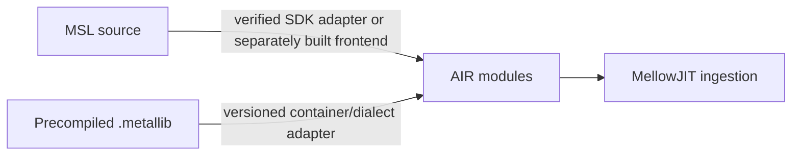

# AIR and metallib — what is known

> **Design draft; implementation status is separate.**
> [PLATFORM-DECISIONS](PLATFORM-DECISIONS.md) and [PLATFORM-ARCHITECTURE](PLATFORM-ARCHITECTURE.md)
> take precedence over conflicting assumptions below. [IMPLEMENTATION-STATUS](IMPLEMENTATION-STATUS.md)
> records policy/intake, the native Windows OpenCL provider, portable Xe tests and kext build evidence.
> Standalone OpenCL probes and MellowRT provider execution have separate records; no Metal, WindowServer
> or display acceptance has passed. Native macOS GPU execution remains unverified.

## 한글 요약

이 문서는 MellowJIT의 입력 형식인 AIR와 metallib에 대해 **현재 확인된 것과 미확인인 것을 구분**해
기록한다. 확인된 것: `Metal.framework`가 `GPUCompiler.framework/Versions/32023`의 두 dylib를
링크하며 `MTLCompiler`·`MTLAirEntry`·`MTLBinaryKey`·`MTLBufferRelocation`·`MTLConstantRelocation`
클래스를 정의한다는 사실. 미확인: metallib 컨테이너의 정확한 헤더 레이아웃, AIR 메타데이터 스키마,
`air.*` 인트린식 전체 목록, 버전 간 안정성.
이 문서는 조사가 진행되면서 갱신되는 **작업 기록**이며, 추측을 사실로 적지 않는다.

---

**Status: survey record. Nothing here has been validated by executing code in this repository.**

This document separates what the ABI survey established from what remains unknown. It exists so
that [SHADER-JIT.md](SHADER-JIT.md) can cite evidence rather than assumption, and so that gaps are
visible as work items.

## Established

All of the following comes from parsing real Apple binaries extracted from macOS 26.6.2 build
25G83, recorded in [TAHOE-ABI.md](TAHOE-ABI.md) and
[abi-evidence/tahoe-graphics-inventory.json](../abi-evidence/tahoe-graphics-inventory.json).

### Compiler-related dependencies were observed

`Metal.framework` links:

- `GPUCompiler.framework/Versions/32023/libllvm-flatbuffers.dylib`
- `GPUCompiler.framework/Versions/32023/libGPUCompilerUtils.dylib`

The versioned path (`32023`) is itself significant: it means the compiler is versioned
independently of the framework, and any Mellow code that depends on it must record which version
it was tested against.

### Relevant Metal.framework classes

Among the 22,728 definitions and 1,018 Objective-C classes in `Metal.framework`:

| Class | Apparent role |
| --- | --- |
| `MTLCompiler` | The compilation driver |
| `MTLAirEntry` | An AIR entry point — the unit MellowJIT must consume |
| `MTLBinaryKey` | Cache keying, relevant to [SHADER-JIT.md](SHADER-JIT.md)'s cache design |
| `MTLBufferRelocation` | Relocation applied to compiled output |
| `MTLConstantRelocation` | Relocation applied to compiled output |

The relocation class names are investigation leads. They do not establish object layout, relocation
semantics or equivalence to Intel ZEBIN; that requires independent evidence
([Mellow/XeZebin.cpp](../Mellow/XeZebin.cpp)).

### Publicly known format facts

These are established outside this repository and are recorded here as context, not as findings:

- `.metal` source compiles to `.air`, and `metallib` packages one or more `.air` modules into a
  `.metallib` archive. This is Apple's documented toolchain structure.
- AIR uses an Apple bitcode dialect; compatibility with a particular stock LLVM reader must be
  established for a pinned SDK corpus. It is not guaranteed for every AIR/metallib version.
- Apple's dialect adds `air.*` intrinsics and named metadata carrying entry-point kind, argument
  bindings, and resource information.
- An LLVM RFC has proposed an experimental Metal target lowering LLVM IR to a loadable
  `.metallib`, and notes that no open-source path from arbitrary LLVM IR to a loadable `.metallib`
  exists today. This is the *opposite* direction from Mellow's need — Mellow reads AIR rather than
  writing it — but it confirms the format is not publicly specified.

## Not established

Each row is a work item for the AIR ingestion stage, and none may be treated as solved.

| Unknown | Why it matters | How it will be resolved |
| --- | --- | --- |
| metallib container layout — header fields, function table, offsets, hashes | Required to locate each AIR module | Parse real metallibs produced by the local toolchain; compare across compiler versions |
| AIR metadata schema — exact named-metadata nodes and their operand structure | Required to recover entry-point kind, argument indices, threadgroup sizes | Compile known MSL with known bindings; diff the metadata |
| Full `air.*` intrinsic inventory | Each intrinsic needs a MIR lowering; an unhandled one must fail loudly | Enumerate from compiled corpus; maintain an explicit supported/unsupported list |
| Bitcode dialect deltas from upstream LLVM | Determines whether stock bitcode readers suffice | Attempt parse with a pinned LLVM; record every failure |
| Stability across macOS and compiler versions | Determines whether MellowJIT needs per-version handling | Compile the same corpus on multiple builds; hash and compare |
| Argument buffer encoding in AIR | Required for Tier 1 argument buffers | Compile argument-buffer shaders; inspect resulting metadata |
| Relocation semantics implied by `MTLBufferRelocation` / `MTLConstantRelocation` | Determines what MellowJIT must patch and when | Reverse the relocation application path, or avoid it by lowering before that stage |
| Whether `GPUCompiler` can be invoked directly and licitly | Affects whether MSL-source compilation can be delegated, or only precompiled metallibs consumed | Test `MTLCompiler` behavior; record what public API reaches it |

## The two input paths

Both are candidate input paths. Runtime compiler invocation is not established; begin with known
SDK-generated AIR and treat source/metallib adapters as separate gated work.

The precompiled path is the simpler of the two and is where ingestion work begins: it requires
only reading the container and the bitcode, with no dependency on invoking Apple's compiler from
within Mellow's process.

## Investigation plan

Ordered so that each step produces a durable artifact under `abi-evidence/`, consistent with how
the existing ABI work was recorded.

1. **Corpus.** Build a small MSL corpus covering the J1 scope from
   [SHADER-JIT.md](SHADER-JIT.md) — scalar and vector arithmetic, buffer arguments, grid position.
   Compile it with the local Xcode toolchain, pinning and recording the toolchain version.
2. **Container.** Parse the resulting `.metallib` files; record the layout with the same rigor the
   Mach-O parsing in [Tools/tahoe-abi.py](../Tools/tahoe-abi.py) uses — bounds-checked, with
   negative test cases.
3. **Bitcode.** Attempt to read each extracted AIR module with a pinned upstream LLVM. Record
   every construct that fails.
4. **Metadata.** For each corpus shader with known bindings, dump the named metadata and correlate
   it with the known bindings. Build the schema from correlation, not from guessing.
5. **Intrinsics.** Enumerate every `air.*` symbol referenced by the corpus. Extend the corpus
   until the inventory stops growing for the J1 scope.
6. **Stability.** Repeat on a second macOS build if one is available, and diff.

Each step's output is a JSON artifact carrying the input hashes and explicit negative-claim fields,
matching the convention used throughout [abi-evidence/](../abi-evidence) and
[validation/](../validation).

## Constraint

Apple's compiler binaries are not redistributable, and nothing in this investigation involves
shipping them. Mellow consumes output produced on the user's own machine by the toolchain already
installed there. The same posture applies here as to firmware: **record provenance and hashes,
redistribute nothing.** See [LICENSING.md](LICENSING.md).
