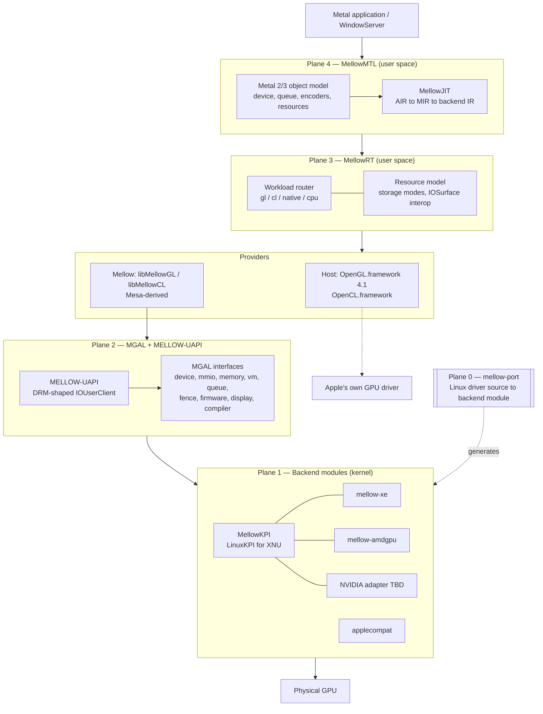
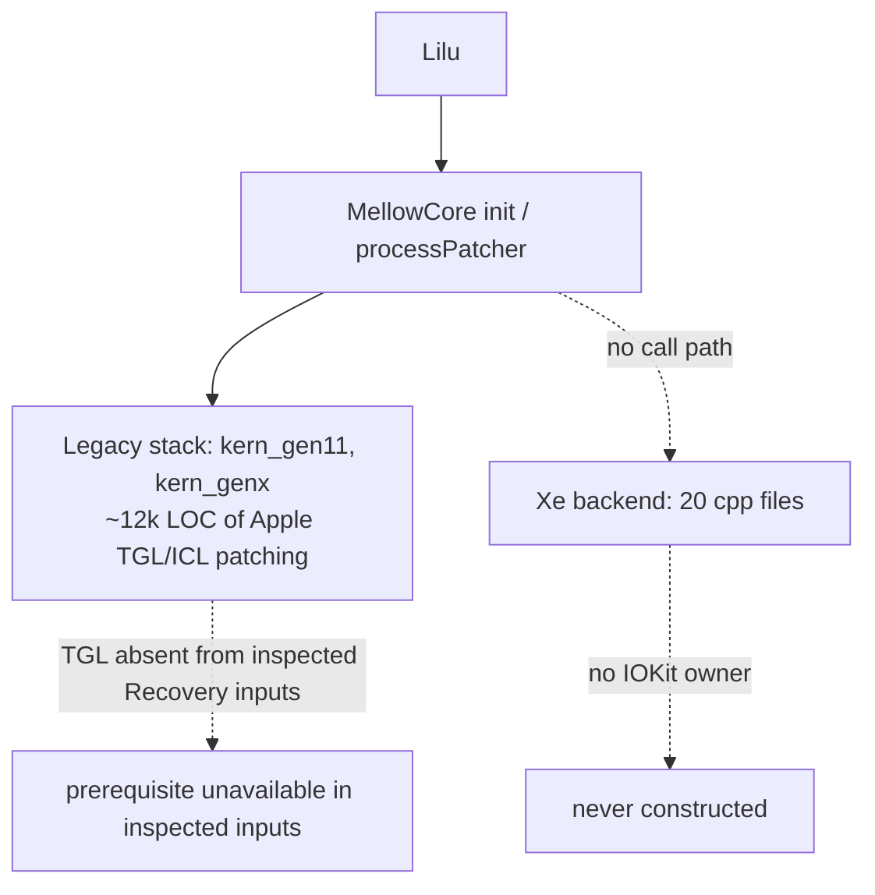

# Mellow architecture

> **Design draft; implementation status is separate.**
> [PLATFORM-DECISIONS](PLATFORM-DECISIONS.md) and [PLATFORM-ARCHITECTURE](PLATFORM-ARCHITECTURE.md)
> take precedence over conflicting assumptions below. [IMPLEMENTATION-STATUS](IMPLEMENTATION-STATUS.md)
> records the runnable policy/intake code. No GPU, Metal, WindowServer or display acceptance has passed.

## 한글 요약

Mellow는 5개 평면으로 구성된다. **Plane 4** MellowMTL(Metal 2/3 표면 + AIR JIT),
**Plane 3** MellowRT(워크로드 라우터와 GL/CL 제공자), **Plane 2** MGAL(벤더 중립 GPU 계약과
MELLOW-UAPI), **Plane 1** backend 모듈과 MellowKPI, **Plane 0** `mellow-port` 백포팅 파이프라인.
평면 사이는 좁고 명시적인 계약으로만 연결되며, 각 평면은 아래 평면 없이도 단독으로 시험할 수 있다.
기존 Intel Xe 조각에는 통합 composition root가 없다. 새 정책/intake 코드는 별도로
구현되어 있으며 실제 GPU/provider에 연결되지 않았다.
아래 모든 서술은 별도 표기가 없는 한 **하드웨어 미검증**이다.

---

All runtime behavior described below is **UNVERIFIED on hardware** unless an experiment record
says otherwise. See [EVIDENCE-POLICY.md](EVIDENCE-POLICY.md).

## The five planes

The important property is that **pure-logic contracts in each plane are host-testable; end-to-end validation still requires the lower provider**:

- Plane 4 can be tested on a specifically admitted accelerated CL provider and compiler path; no Mellow kext is required for that host subset.
- Plane 3 can be validated against either provider kind.
- Plane 2's pure-logic halves already run in host tests today, with emulated MMIO and ownership
  callbacks ([Tools/run-xe-tests.py](../Tools/run-xe-tests.py)).
- Plane 0 is validated by regenerating a backend that already exists in hand-written form.

## Plane 4 — MellowMTL

Provides the Metal API surface and compiles shaders for whatever substrate Plane 3 selects.

The first target is an explicit off-screen subset, not a GPU-family claim. `supportsFamily` remains
false until all mandatory requirements of that family pass, not merely a conformance subset.
`MTL4*` — the next-generation surface present in Tahoe's `Metal.framework` — is out of scope.

The shader path begins with versioned SDK-generated AIR. Runtime MSL needs a verified compiler
adapter or a separately implemented frontend; framework symbols alone are insufficient. See [METAL-EMULATION.md](METAL-EMULATION.md),
[SHADER-JIT.md](SHADER-JIT.md), and [AIR-ABI.md](AIR-ABI.md).

## Plane 3 — MellowRT

Owns resources and validates routes within an admitted device/provider domain. Cross-provider
sharing requires explicit ownership, visibility and ordering contracts.

Two kinds of provider exist, and they correspond to the two halves of the thesis in
[CONCEPT.md](CONCEPT.md):

| Provider kind | Backing | Applies to |
| --- | --- | --- |
| **Host** | Apple `OpenGL.framework` (4.1 core) and `OpenCL.framework` | GPUs that already have an accelerated Apple driver |
| **Mellow** | `libMellowGL` / `libMellowCL`, Mesa-derived, running on MGAL | GPUs with no macOS driver at all |

The router's `cpu` path exists only to produce reference values for tests. It is unreachable
without explicit opt-in, and work completed through it is observably marked. See
[WORKLOAD-RUNTIME.md](WORKLOAD-RUNTIME.md).

## Plane 2 — MGAL and MELLOW-UAPI

MGAL is the vendor-neutral GPU contract. It is not a new invention: the existing `Xe*` modules
already separate freestanding C++17 logic from IOKit binding through POD function-pointer ops
structs, and MGAL is the promotion of those ops structs into named interfaces.

MELLOW-UAPI is the user/kernel boundary, deliberately shaped like DRM's ioctl surface
(`GEM_CREATE`, `GEM_MMAP`, `VM_BIND`, `EXEC`, `SYNCOBJ_*`) so that Mesa winsys code ports
mechanically. See [MGAL.md](MGAL.md) and [MELLOW-UAPI.md](MELLOW-UAPI.md).

## Plane 1 — Backend modules and MellowKPI

MellowKPI is a Linux-kernel API compatibility layer for XNU, following the approach FreeBSD's
`drm-kmod` uses to run Linux i915 and amdgpu with minimal modification. Backend modules are
compiled Linux driver sources plus a small generated glue layer. See [MELLOWKPI.md](MELLOWKPI.md).

`applecompat` names the retained legacy Apple-compatibility research path. An ICL-focused
experiment is proposed; the inspected Recovery inventory also contains other Intel framebuffers. See
[LEGACY-DISPOSITION.md](LEGACY-DISPOSITION.md).

## Plane 0 — mellow-port

The host toolchain that turns a Linux driver tree into a backend module: SPDX license gate,
machine extraction of register and PCI-ID tables, KPI symbol resolution with a gap report, glue
emission, cross-compilation, and provenance recording. See
[BACKPORT-PIPELINE.md](BACKPORT-PIPELINE.md) and [ADDING-A-GPU.md](ADDING-A-GPU.md).

## Current state versus the target

The legacy GPU work contains two disjoint stacks, and neither reaches a GPU. New Runtime/intake
code is separate and does not close those execution paths.

- The `Xe*` modules compile into the kext but have **zero call sites**; `#include "Xe` appears
  nowhere outside `Mellow/Xe*`. There is no IOKit provider, workloop, or reset epoch that
  constructs them. This is recorded at
  [Mellow/RuntimeReadiness.hpp:84](../Mellow/RuntimeReadiness.hpp) and analysed in
  [NATIVE-XE-BACKEND-AUDIT.md](NATIVE-XE-BACKEND-AUDIT.md).
- The intended landing site exists but is unfinished: the `IOResources` personality at
  [Mellow/Info.plist](../Mellow/Info.plist) has no backing class, because the `IOService`
  subclass at [Mellow/kern_start.cpp:52](../Mellow/kern_start.cpp) is commented out and
  `LILU_CUSTOM_IOKIT_INIT` is not defined.
- TGL acceleration binaries targeted by the legacy stack were not found in the inspected
  Recovery artifacts; full installed-system/optional-component coverage has not been established.

## Gap analysis

| Boundary | Current state | Major gap | Evidence required to close it |
| --- | --- | --- | --- |
| Metal API surface | None. Info.plist names unverified Apple bundles absent from inspected Recovery inputs | No Mellow-owned `MTLDevice` exists | Device enumerated from Mellow, correlated to a physical PCI device |
| Shader path | Intel OpenCL C to ZEBIN harness only; unrelated to Metal | No AIR reader, no MIR, no lowering | A Metal function compiled through MellowJIT producing a correct GPU result |
| Workload routing | None | No resource model, no provider abstraction | Same command buffer producing identical results on two providers |
| Vendor-neutral abstraction | Ops structs exist per `Xe*` module, Intel-specific | No named interfaces; device identity duplicated in ≥7 places | Two backends implementing the same interfaces with a shared test suite |
| Composition root | Absent | Nothing constructs MMIO, VM, firmware, IRQ, fence, or context objects as one reset epoch | A provider that owns one epoch and tears it down cleanly |
| User/kernel ABI | Absent | No IOUserClient, no selector contract | A round-trip allocation and mapping from user space |
| Linux compatibility layer | Absent | No `linux/*` or `drm/*` headers for XNU | An unmodified upstream driver file compiling against MellowKPI |
| Backport automation | Source intake/report and bounded extraction exist | Complete semantic translation and XNU binding generation are absent | Reviewed backend regeneration remains a target |
| Firmware | Fetch-and-verify tooling only, Intel GuC | Per-vendor firmware handling; authentication unproven | Firmware loaded and authenticated by the device |
| Display | TGL/ICL framebuffer patching; `DisplayMergeNub` personality is live | No Mellow-owned modeset or scanout | A modeset performed through Mellow with captured output |
| Multi-vendor support | None. No AMD or NVIDIA code exists | Everything above, per vendor | Per-backend matrices in [GPU-SUPPORT-MATRIX.md](GPU-SUPPORT-MATRIX.md) |

## Design invariants

These hold across all planes and are not negotiable per component.

1. **Hardware-independent logic is separated from platform binding.** Every module splits into a
   freestanding C++17 core (no IOKit, no allocation, fixed-size arrays) and a thin binding layer
   that supplies effects through a POD ops struct. This is the existing pattern and it is why the
   host test suite can exercise production source directly.
2. **Device identity comes from one table.** The current tree contradicts this — `7D41` appears 39
   times across 26 files, and admission logic is duplicated in at least four `*IOKit` files while
   [Mellow/kern_model.hpp](../Mellow/kern_model.hpp) already holds a proper table. Consolidating
   this is the first task of P1.
3. **No capability is exposed before its conformance test passes.** Enforced by the readiness
   ladder, extended per backend.
4. **No path manufactures success.** See [EVIDENCE-POLICY.md](EVIDENCE-POLICY.md).
5. **Upstream references are pinned by commit SHA**, and every ingested file's license is
   recorded. See [LICENSING.md](LICENSING.md).

## Incremental implementation order

The order is chosen so that each step is independently verifiable and failures are attributable to
one boundary. Full detail in [ROADMAP.md](ROADMAP.md).

1. Freeze the concept and the interfaces in documentation (this set).
2. Extract MGAL from the existing `Xe*` modules; collapse duplicated device identity into one table.
3. Build the composition root and MELLOW-UAPI; make the Xe backend reachable.
4. Build MellowKPI and the backport pipeline; regenerate the Xe backend from Linux source.
5. Build versioned AIR/MIR to OpenCL C lowering; gate a SPIR-V IL route on provider support.
6. Build MellowMTL interposition; run a Metal compute workload end to end.
7. Add the graphics path and the OpenGL provider.
8. Implement reviewed amdgpu and selected NVIDIA adapters; bring up RX 9070 and RTX 3080/3090.
9. Add native submission, display ownership, and the Metal 3 subset.

Each step ends in a commit and an experiment record. If a step fails, the next change targets that
failure boundary rather than broadening the patch set.
