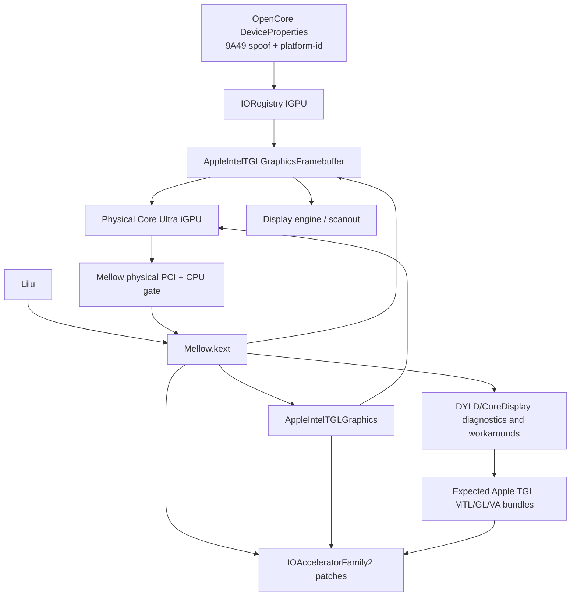
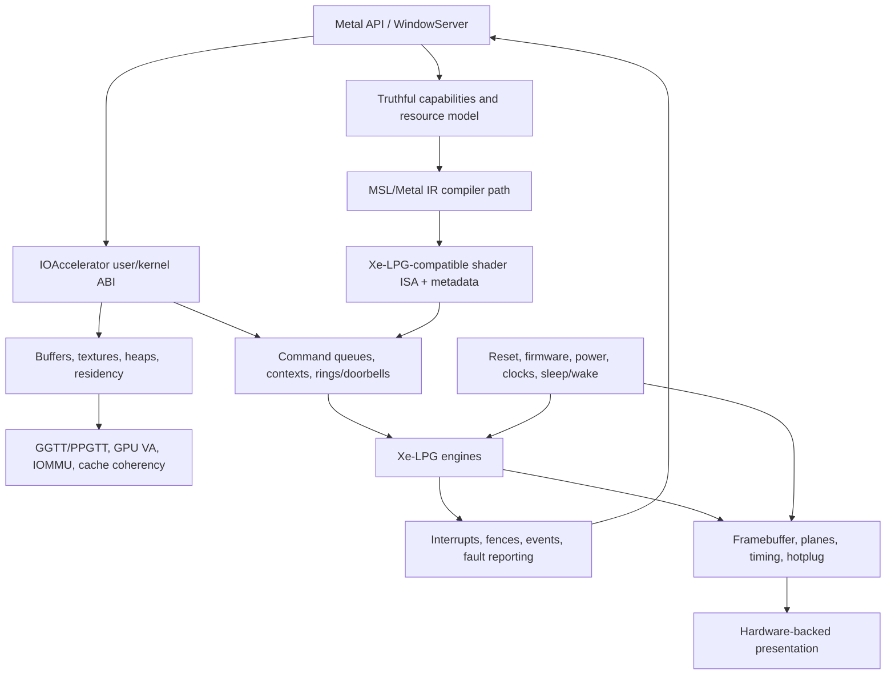

# Mellow architecture and the Metal target

Mellow is currently a Lilu patch plug-in around Apple's Tiger Lake graphics
stack. It is not a complete Xe-LPG kernel driver, user-space Metal driver, or
shader compiler. The target is full, correct GPU execution; the present design
is only one compatibility hypothesis for reaching it.

All runtime behavior discussed below is **UNVERIFIED on hardware** unless an
experiment record says otherwise.

## Current compatibility stack

The important boundaries are:

- OpenCore properties present a TGL-compatible identity to Apple's matching
  logic. Mellow separately reads the physical PCI configuration identity so an
  injected `device-id` cannot bypass its Ultra allow-list.
- Mellow routes symbols and applies binary patches in Apple framebuffer,
  accelerator, IOAccelerator, and selected user-space paths. Many of these are
  inherited or OS-build-specific experiments.
- Apple TGL binaries remain responsible for most memory management, context
  creation, command encoding, shader handling, and display behavior. A source
  hook being present does not demonstrate that those binaries satisfy Xe-LPG
  hardware contracts.
- Mellow's ADL-P DMC mode is a compatibility profile plus Apple-initializer
  fallback. It is not a native Meteor/Arrow Lake firmware implementation.
- Mellow does not redistribute Apple graphics binaries. The required bundle
  source, version match, integrity, and lawful installation are external
  deployment concerns and must be documented for each test environment.

## Full acceleration target

A complete port must preserve Metal's resource, ordering, synchronization, and
error semantics across every arrow. Capability flags may be exposed only after
the corresponding path produces correct results.

## Gap analysis

| Boundary | Current approach | Major unknown or gap | Evidence required to close it |
| --- | --- | --- | --- |
| Hardware identity | Physical CPU/GPU pair gate plus injected TGL identity | Whether all admitted IDs share the assumed register and engine contracts | PCI config and generation-specific register evidence per ID |
| Probe/BAR | `IOPCIDevice` access and BAR0/BAR2 mapping helpers | Positive map evidence, legal offsets, coherency, and teardown lifetime | Map length/base metadata plus repeated safe read and clean detach |
| Firmware/reset/power | Apple CSR fallback with TGL/ADL-P compatibility sequences | Xe-LPG firmware expectations, sequencing, timeout behavior, and recovery | Firmware status, force-wake/reset traces, bounded timeout and recovery test |
| Display | TGL framebuffer patches, compatibility topology, optional target timing writes | PHY/link training, CDCLK, DDI/Type-C topology, hotplug, PSR, and modeset differences | Register/log trace against a reference plus modeset and CRC/capture tests |
| GPU virtual memory | Apple TGL allocator and inherited GGTT/context patches | PTE format, address widths, PAT/cache policy, IOMMU interaction, invalidation | Mapped-address audit, read/write test, fault decoding, teardown test |
| Command submission | Apple TGL command path plus experimental ring/context hooks | Context image format, engine registers, doorbells, scheduling, preemption | One NOP/copy with head/tail, batch bytes, IRQ, fence, and output correlation |
| Interrupt/synchronization | Apple handlers plus stamp/wait workarounds | Correct interrupt routing, acknowledgement, ordering, and fence progression | Before/after counters and timestamps; no forced-success path in proof test |
| IOAccelerator ABI | Patched IOAcceleratorFamily2 checks and routed methods | Object layouts and feature contracts for the exact macOS build | Versioned symbol/layout audit plus deterministic buffer lifecycle test |
| Metal device/capabilities | Expected TGL MTL bundle names and load-path diagnostics | Whether a real device is constructed and features are truthful | API probe, logs, capability matrix, negative tests for unsupported features |
| Shader path | Relies implicitly on Apple's TGL user-space path | Whether emitted code/metadata is valid for Xe-LPG; no Mellow compiler exists | Captured compile diagnostics and a minimal shader with verified GPU output |
| Presentation | CoreDisplay/WindowServer workarounds | Correct surface ownership, hazard tracking, completion, and scanout | Hardware counters, IOSurface contents, display capture, no CPU fallback |
| Lifecycle | Scattered guards and inherited power paths | Reset-on-hang, sleep/wake, modeset, memory pressure, multi-process behavior | Repeated test matrix with panic/hang collection and known-good recovery |

## Compatibility strategy versus a deeper port

The current TGL-spoof strategy is viable only if measurement shows that the
Apple TGL stack's command ABI, memory model, and emitted shader code are usable
on the target Xe-LPG GPU after a bounded set of generation adaptations.

Two paths remain open:

1. **Compatibility path:** retain Apple TGL framebuffer, accelerator, and Metal
   components; implement only measured register, topology, VM, submission, and
   synchronization differences. This is the smallest path but must be rejected
   if ISA/ABI or resource semantics are incompatible.
2. **Translation/reimplementation path:** introduce an explicit user/kernel ABI
   adapter and possibly a shader IR/backend when the Apple component cannot
   correctly target Xe-LPG. This is much larger and requires clean-room design,
   source/license tracking, conformance tests, and an explicit fallback policy.

Do not choose between them from device enumeration alone. The decision point is
a minimal command and shader experiment with captured inputs, output bytes,
engine progress, and synchronization evidence.

## Incremental implementation order

1. Freeze toolchain, macOS build, driver bundle versions, EFI, and recovery.
2. Prove physical identity, expected driver selection, and BAR mapping (`E0001`).
3. Add read-only register/status instrumentation with cited Xe-LPG definitions.
4. Prove reset/force-wake and a single command completion without forced fences.
5. Validate GPU VM with a bounded copy and fault-aware teardown.
6. Establish compute correctness before display compositing.
7. Establish off-screen render correctness before WindowServer integration.
8. Probe Metal features individually and expose only verified capabilities.
9. Add lifecycle, fault recovery, regression, and performance testing.

Each step ends in a small commit and an experiment record. If a step fails, the
next change must target that failure boundary rather than broadening the patch
set.
