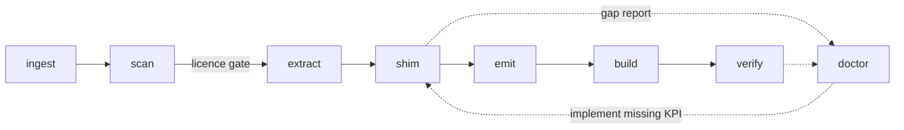

# Plane 0 — `mellow-port`, the backport pipeline

> **Design draft; implementation status is separate.**
> [PLATFORM-DECISIONS](PLATFORM-DECISIONS.md) and [PLATFORM-ARCHITECTURE](PLATFORM-ARCHITECTURE.md)
> take precedence over conflicting assumptions below. [IMPLEMENTATION-STATUS](IMPLEMENTATION-STATUS.md)
> records the runnable policy/intake code. No GPU, Metal, WindowServer or display acceptance has passed.

## 한글 요약

검토된 GPU family recipe와 Darwin adapter를 바탕으로 반복 포팅을 재현하는 도구를 목표로 한다.
현재 `inspect`, `plan`, `generate`가 입력 소스·라이선스 표식·의존성 단서와 미구현 계약을
보고하고 제한된 상수를 추출한다. 완성된 Linux→XNU driver를 생성하거나 빌드하지 않는다.
아래 8단계 명령은 향후 설계이며 현재 CLI가 아니다. 헤더 치환, 추출, 빌드만으로
memory/IRQ/fence/reset 의미가 충족되지 않으며 기존 미검증 Xe 코드를 정답지로 취급하지 않는다.

---

**Status: `inspect`, `plan`, `generate` source analysis/report operations exist. Complete semantic
translation, platform binding generation and driver build remain planned; see IMPLEMENTATION-STATUS.**

## The problem it solves

The requirement is explicit:

> *"드라이버는 만들기 쉬워야 하며, 백포팅의 과정이 쉬워야 한다. 리눅스 드라이버 파일만 넣어도
> 바로 백포팅되는 수준이여야 한다. 사실상 '리눅스 드라이버'를 기반으로 자동으로 변환하여
> 처리하는 수준의 기능이 필요하다."*

The current state is the exact opposite. **Every line of Linux-derived logic in this tree was
transcribed by hand.** The recorded methodology was:

1. Pin one Linux commit (`4d7d9486c04d917265f64c55bd23b2cc4fe7749c`).
2. Download specific `.c` / `.h` files into a scratch directory.
3. Write a `provenance.json` with per-file URL, revision, byte count, and SHA-256.
4. **Read the Linux code and write an independent bounded C++ implementation.**
5. Add a one-line attribution comment.
6. Write a `docs/XE-*.md` citing specific upstream functions.
7. Write a host test harness that compiles the production source.
8. Stamp the result JSON with negative claims.

Automation exists for firmware fetch and hash verification
([tests/xe_submission_fetch_firmware.py](../tests/xe_submission_fetch_firmware.py)), test
execution ([Tools/run-xe-tests.py](../Tools/run-xe-tests.py)), and Xcode project mutation. **Step 4
— the translation — has no automation whatsoever.** That is the gap this plane fills.

Adding a GPU today requires editing 39 hardcoded literals across 26 files, and a different vendor
shares nothing at all.

## Why automation is credible

Five mechanisms, each addressing a specific way this kind of project usually fails.

### 1. Source license review precedes generation

Current intake records SPDX and original notices; unknown identifiers become review gaps.
Inspection remains available, while affected source generation is skipped. The proposed full
pipeline also needs dependency-closure review; no isolate flag grants compatibility.

This is not optional bookkeeping — it is the difference between a legally clean backend and an
unusable one. Directory names do not establish license eligibility: scan original notices and the
full DRM/Linux dependency closure per file. See [LICENSING.md](LICENSING.md) for the
full policy and the constraints it enforces.

### 2. Header substitution, not source rewriting

Minimizing source changes is a target after a reviewed semantic Darwin adapter exists. Header
substitution and FreeBSD experience do not prove XNU memory/concurrency/IRQ equivalence. See
[MELLOWKPI.md](MELLOWKPI.md) and RFC D07–D08.

Unavoidable edits become a patch series under `patches/<backend>/`, keeping the delta from upstream
visible and re-appliable against a newer Linux release.

### 3. The data plane is extracted mechanically

Register definitions, PCI ID tables, IP block descriptors, firmware filenames, and ioctl structures
are **parsed with libclang and emitted as Mellow tables**. No human retypes a register offset.

This directly attacks the largest source of silent error in the current approach. Compare:

- Hand-transcribed constants scattered through the Xe backend —
  [Mellow/XeInterrupt.hpp](../Mellow/XeInterrupt.hpp),
  [Mellow/XeGuCTransport.hpp](../Mellow/XeGuCTransport.hpp),
  [Mellow/XeGuCFirmware.cpp](../Mellow/XeGuCFirmware.cpp) — each correct only if typed correctly.
- The one genuinely table-driven artifact in the legacy stack, `__gen11_fw_ranges[]` in
  [Mellow/kern_gen11.hpp](../Mellow/kern_gen11.hpp), which was copied verbatim from i915 precisely
  because retyping it would be absurd.

Extraction generalizes the second case to everything.

### 4. Coverage-driven, not all-or-nothing

The pipeline is not required to produce a complete driver on first run, and it does not pretend to.

Every Linux symbol or semantic contract MellowKPI does not implement becomes a **blocking gap**, and
the proposed `mellow-port doctor` reports unresolved contracts and source coverage. Porting becomes an iterative
loop with a visible metric, instead of a cliff.

A stub that returns a neutral success value is a bug. See [EVIDENCE-POLICY.md](EVIDENCE-POLICY.md).

### 5. Compare against reviewed contracts and existing regression inputs

**The pipeline's first target is the `xe` backend that already exists in hand-written form.**

This is the key validation strategy. The hand-written implementation is a regression input, not a hardware-validated answer key. The
generated backend can be compared with pinned upstream contracts and existing host behavior
under the existing host test suite ([Tools/run-xe-tests.py](../Tools/run-xe-tests.py)). A pipeline
whose first output is a driver nobody can check is a pipeline nobody should trust.

## Proposed complete pipeline commands

Only `inspect`, `plan`, `generate` currently exist in `Tools/mellow-port.py`; see
[IMPLEMENTATION-STATUS](IMPLEMENTATION-STATUS.md). The command vocabulary below is a design target,
not an executable CLI. Current output is review material and does not build a GPU backend.

```
mellow-port ingest  --src <linux tree|driver dir> [--uapi <dir>] --rev <sha>
mellow-port scan                       # proposed per-file license and dependency review gate
mellow-port extract                    # register defs, PCI IDs, IP blocks, firmware names, ioctls
mellow-port shim                       # resolve symbols against MellowKPI; emit gap report
mellow-port emit                       # module init, MGAL binding, Info.plist, profile plist
mellow-port build                      # cross-compile to <name>.mbe plus tests
mellow-port verify                     # host tests, Mach-O validation, symbol closure, provenance
mellow-port doctor                     # human-readable gap report and KPI coverage
```



### `ingest`

Copies or references the source tree, pinning the revision. Records every file with URL, revision
SHA, byte count, and SHA-256.

### `scan`

The proposed scan records SPDX and original notices per file with dependency-closure review.
Current inspect can report missing SPDX; generation skips such sources pending review, rather
than refusing the whole inspection. See [LICENSING.md](LICENSING.md).

### `extract`

libclang-based. Produces machine-readable tables:

| Extracted | From | Becomes |
| --- | --- | --- |
| PCI device IDs | `pciids.h`, `*_pci.c` device tables | The backend's device descriptor table for `IMellowDevice` |
| Register offsets and bitfields | `*_regs.h`, `*_offset.h`, `*_sh_mask.h` | Generated register headers |
| IP block / version descriptors | Driver init tables | Capability descriptors |
| Firmware filenames and versions | `MODULE_FIRMWARE`, `*_uc_fw.c` | Firmware manifest for fetch-and-verify |
| UAPI structures | `include/uapi/drm/*.h` | [MELLOW-UAPI](MELLOW-UAPI.md) structure definitions |

### `shim`

Compiles against MellowKPI and collects unresolved symbols and includes. Emits a gap report. This
is the loop that grows MellowKPI.

### `emit`

Generates the glue that is genuinely Mellow-specific and cannot come from Linux:

- Module entry and exit, and the composition root wiring described in [MGAL.md](MGAL.md)
- Bindings from the driver's internal interfaces to MGAL interfaces
- `Info.plist` with `OSBundleLibraries` on `com.NiSeullent.MellowKMD`
- A device profile plist, generalizing the `MellowDriverProfiles` mechanism already present in
  [Mellow/Info.plist](../Mellow/Info.plist)

### `build`

Cross-compiles. The existing [Tools/cross-build.py](../Tools/cross-build.py) is the starting point
and handles packaging details such as: `-target x86_64-apple-macos13 -mkernel -fapple-kext`, synthesized
`module_info.c` with `KMOD_EXPLICIT_DECL`, linking against `MacKernelSDK/Library/x86_64/libkmod.a`,
verifying `filetype == 11` (`MH_KEXT_BUNDLE`), and hashing every input before and after to refuse a
changed artifact.

Notably it already **parses `PBXSourcesBuildPhase` out of the pbxproj** so the Xcode and
command-line builds cannot diverge — which is exactly the hook a generated backend needs.

### `verify`

Runs host tests on the pure-logic halves, validates the Mach-O, checks symbol closure against the
target kernel's KPI export sets using [Tools/tahoe-abi.py](../Tools/tahoe-abi.py), and writes the
provenance manifest.

### `doctor`

The human-facing report: what is missing, ranked by how many call sites need it, plus a KPI
coverage percentage and the list of unresolved contracts; missing semantics must not enter an executable backend as stubs.

## Provenance schema

Standardized on the shape already used by
[tests/xe_interrupt_provenance.json](../tests/xe_interrupt_provenance.json), which is the most
complete of the three existing manifests:

```json
{
  "scope": "...",
  "linux_commit": "<full sha>",
  "files": [
    { "path": "...", "url": "...", "revision": "<sha>", "bytes": 0, "sha256": "..." }
  ],
  "hardware_execution": false,
  "gpu_executed": false,
  "metal_tested": false
}
```

Two proposed manifest requirements are added; current intake records supplied revision metadata
and does not independently prove Git commit attribution:

1. **`revision` must be a commit SHA.** The existing manifest carries
   `"revision": "main observed; content hash pinned below"` for the Apple XNU files — a floating
   branch pinned only by content hash. An automated pipeline cannot accept that.
2. **Every referenced file carries its SPDX identifier** in the manifest, so the license decision
   is auditable after the fact, not only at ingest time.

## What the pipeline does not do

- It does not make an unfinished driver work. It produces a compiling, structurally faithful
  backend with a known gap list.
- It does not solve the composition-root problem described in [MGAL.md](MGAL.md). A generated
  backend needs an owner just as the hand-written one does.
- It does not redistribute firmware. It generates a fetch-and-verify manifest. See
  [LICENSING.md](LICENSING.md).
- It does not change the evidence level of anything it produces. Generated code starts at `S`, and
  reaches `B` when it builds. Nothing else follows automatically.

## Tutorial

[ADDING-A-GPU.md](ADDING-A-GPU.md) walks the whole flow for the RX 9070.
