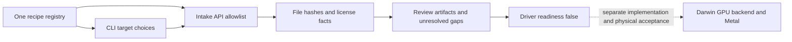

# Intel and NVIDIA source intake

This change implements source-review routes for Intel `i915` and NVIDIA
`nouveau`, alongside the existing `xe`, `amdgpu` and `nvidia-open` routes.
It also admits NVIDIA's OS-independent display source at `src/nvidia-modeset/`.
The CLI and intake API read the same `porting/backend-recipes.json` registry.

These are source-intake operations, not executable Darwin GPU backends.
They do not change PCI matching, firmware loading, kernel entry points,
Metal registration, display ownership or the existing Intel diagnostic service.
Generated receipts retain `driver_ready=false`, `compile_performed=false`
and `hardware_test_performed=false`. `--require-ready` emits review artifacts
and returns exit code 2. PCI IDs and implemented entry points remain empty.

## Source routes and implementation boundaries

| Route | Admitted driver source | Required implementation work |
| --- | --- | --- |
| `i915` | `drivers/gpu/drm/i915/` | Select a generation and OS support history; implement GGTT/PPGTT, generation-specific firmware, submission and display contracts |
| `xe` | `drivers/gpu/drm/xe/` | Distinguish Xe-LP, Xe-LPG, discrete Xe-HPG, Xe2 and later IP; implement the physical PCI owner, VM, GuC, interrupt/fence and userspace contracts |
| `nouveau` | `drivers/gpu/drm/nouveau/` | Review chip-specific NVKM initialization, memory/channel ownership, firmware and power management; implement the Darwin UAPI and selected Mesa userspace adapter |
| `nvidia-open` | `kernel-open/`, `src/nvidia/`, `src/nvidia-modeset/` | Turing and newer upstream scope; adapt RM/GSP, memory, interrupts and display, and select an explicit compatible userspace ABI |

The `i915`, `xe` and `nouveau` recipes may also inspect explicit files under
`include/drm/` and `include/linux/`. Common headers alone do not identify a
backend and are rejected. Sibling paths such as `nouveau-extra/` are not admitted.
The NVIDIA recipe also permits explicit `src/common/` dependencies, but requires
at least one file from its driver or kernel-interface prefixes.
This is a bounded allowlist, not a complete Linux/DRM dependency closure.

NVIDIA's open modules explicitly target Turing and later. Maxwell, Pascal and
Volta therefore need a separate route such as Nouveau; choosing `nvidia-open`
cannot extend that upstream hardware scope. A Nouveau source receipt also does
not establish firmware availability, clocks, performance or macOS support.
NVIDIA RM and Nouveau/NVK have different userspace contracts. They cannot be
connected by assuming that their Linux ioctl or memory semantics are identical.

Intel's newer Linux Xe driver contains different DMA widths, page-table levels,
memory types and graphics/media IP discovery across families. The existing
Mellow `7D41` memory and GuC contracts cannot be reused solely by adding PCI IDs.
Older Intel devices must also distinguish original Apple support from support
removed in a newer macOS release. These source routes are OS-independent;
macOS 15 and 26 acceptance remains a separate per-device record.

## Review workflow

Choose explicit source files from a locally available, pinned upstream checkout.
The revision is a provenance claim; this tool measures file hashes but does not
attest that those files belong to the claimed Git revision. Generated license
facts also require review before copying or distributing upstream code.

```sh
python3 Tools/mellow-port.py plan \
  --source-root /path/to/linux \
  --target nouveau \
  --revision <full-immutable-upstream-commit> \
  --file drivers/gpu/drm/nouveau/nouveau_drm.c \
  --output /path/to/new-nouveau-review \
  --require-ready
```

The expected exit code is 2 because native driver readiness is unavailable.
For Intel source review, choose `i915` with an explicit path below
`drivers/gpu/drm/i915/`, or `xe` with a path below `drivers/gpu/drm/xe/`.
These examples do not download or execute upstream source.



## Primary source references

- [NVIDIA module structure and compatible GPUs](https://github.com/NVIDIA/open-gpu-kernel-modules#compatible-gpus): OS-independent RM/modeset code, Turing+ scope, and matching firmware/userspace release requirements.
- [Nouveau power-management status](https://nouveau.freedesktop.org/PowerManagement.html): generation-specific firmware and reclocking limitations.
- [Mesa NVK](https://docs.mesa3d.org/drivers/nvk.html): its userspace, Linux kernel requirements and hardware scope are not Darwin acceptance evidence.
- [Linux Xe PCI descriptors](https://github.com/torvalds/linux/blob/master/drivers/gpu/drm/xe/xe_pci.c): per-family DMA, memory and VM-level distinctions.
- [Intel i915 hardware inventory](https://dgpu-docs.intel.com/overview/supported-hardware/i915-driver-gpus.html) and [Xe hardware inventory](https://dgpu-docs.intel.com/overview/supported-hardware/xe-driver-gpus.html): upstream hardware identifiers, not macOS driver readiness.
- [Apple IOFramebuffer](https://developer.apple.com/documentation/kernel/ioframebuffer): basic framebuffer support and full graphics integration are separate.
- [OpenNVDA's Metal implementation notes](https://github.com/bdwithganesh/OpenNVDA/blob/main/drivers/NVMTLDriver/README.md): inspectable reference code with missing AIR, shader and WindowServer functionality; author-reported runtime results have not been reproduced here.

These web references were reviewed on 2026-09-30. Upstream development branches
can change; actual source imports must record an immutable revision and content
hashes. No vendor firmware or upstream driver code was downloaded into this change.

## Validation scope

The source-intake regression suite checks both new routes through the API and
CLI, common-header-only and wrong-backend rejection, sibling-prefix rejection,
review artifact receipts, NVIDIA modeset source admission, and unchanged
readiness behavior. It runs entirely on a host with temporary source fixtures.
Passing this suite is not a kext build, macOS load, GPU execution, Metal or
WindowServer result. See the local case report for the recorded run.
