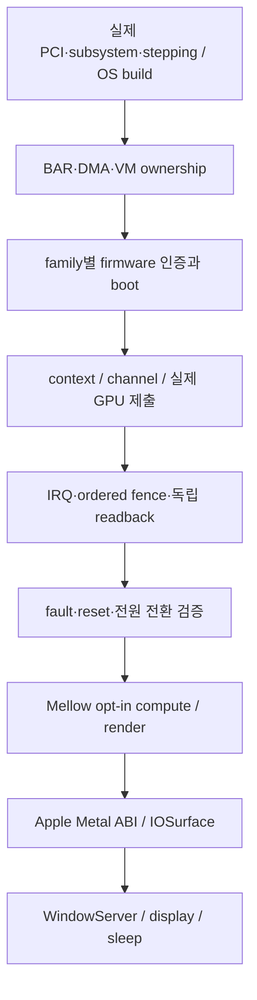

# Intel·NVIDIA GPU 포팅: macOS 15 / 26

대상은 사용자가 지정한 Intel 미지원 그래픽 전체와 NVIDIA Maxwell 이후 전체이며, 운영체제는 macOS 15와 26이다. 이 범위는 개발 목표다. 현재 모든 모델의 가속을 제공하는 드라이버가 완성된 상태는 아니다.

이 작업 사본은 `codex/mellow-gpu-port-1edd`이며, 기준 commit은 `18d576866d6c2ae3543b5df2551c34dff8b8a45f`이다. 본 채팅은 Intel GuC transport, NVIDIA 명령 인코더, macOS용 Metal 호출 어댑터와 IOSurface 앱 표시 경로를 구현한다. 병렬 채팅의 source-family 계약 commit `cd187f4`는 비교 검토 후 `659ce58`로 통합했다. native memory/probe/queue/copy 및 IOKit 코드 34개 파일은 변경 전후 해시가 일치하는 로컬 소스 스냅샷으로 선택 통합했다. 원본 작업 공간은 수정하지 않았으며 Intel GGTT bridge와 NVIDIA MMU의 별도 개발은 해당 채팅에 남겨 두었다.

## 계열별 실행 경계

| 대상 | 커널 출발점 | 사용자 공간 출발점 | 필요한 Darwin 경계 |
|---|---|---|---|
| 최신 OS에서 제거된 구형 Intel | 해당 OS의 Apple binary와 i915 경로를 각각 검토 | 해당 세대의 compiler와 resource ABI | OS별 Apple ABI 호환성을 입증하거나 독립 backend 구현 |
| Intel Xe-LP: Tiger/Rocket/Alder/Raptor Lake, DG1 | family에 맞는 i915 또는 xe | Mesa Iris/ANV, Intel NEO | PCI/BAR, DMA, VM, firmware, context, IRQ/fence/reset |
| Intel Xe-HPG: Arc Alchemist | 해당 DG2 i915/xe 경로 | Mesa/NEO | discrete VRAM·BAR·migration과 firmware 인증 |
| Intel Xe-LPG: Meteor/Arrow Lake | 기존 Mellow Xe 연구 코드와 pinned xe | Mesa/NEO | GT/IP별 PAT·GGTT·GuC/GSC·실제 제출 owner |
| Intel Xe2 이후 | 각 family의 pinned xe | 해당 family를 지원하는 compiler/winsys | 명령·cache·VM·firmware를 세대별로 검증 |
| NVIDIA Maxwell/Pascal/Volta | Nouveau NVKM | Mesa Nouveau/NVK/NAK | Falcon/ACR, GPUVM, channel, Nouveau ABI, IRQ/fence/reset |
| NVIDIA Turing/Ampere/Ada | NVIDIA open RM/NVKMS 또는 Nouveau NVKM | 선택한 커널과 일치하는 provider | GSP·VM·submission과 RM 또는 Nouveau의 정확한 ABI |
| NVIDIA Blackwell 이후 | 해당 제품의 RM/Nouveau와 firmware boot 경로 | 해당 class와 일치하는 compiler/winsys | FSP/GSP 등 boot 경로를 별도 검증 |

NVIDIA open kernel modules는 Turing 이후 대상이다. Maxwell/Pascal/Volta를 이 backend에 추가하는 것으로 드라이버를 만들 수 없다. RM과 Nouveau/NVK의 memory·channel·submission ABI는 서로 다르다. Mesa가 macOS에서 컴파일된다는 사실도 Linux hardware driver의 Darwin 실행을 뜻하지 않는다.

## 실제 코드 변경의 관문

Intel transport에서는 최종 응답의 수신 여부를 credit ownership과 별도로 기록한다. FAST_REQUEST는 credit을 잡지 않는 경우에도 한 번의 실패 응답을 받을 수 있으므로, credit 유무만으로 중복 final 응답을 식별할 수 없다. 정상 BUSY 반복과 timeout 뒤 첫 late final은 유지하되, 이미 끝난 응답의 재수신은 기존 결과를 바꾸기 전에 transport fault로 처리해야 한다.

CT descriptor와 H2G/G2H buffer는 CPU 주소 범위에서도 겹치면 안 된다. 주소 끝 계산의 overflow와 구조적 overlap은 callback이나 memory reset 전에 검사한다. 이 검사는 실제 물리 alias, DMA coherency, GGTT publication, CTB stopped 상태를 입증하는 hardware owner의 책임을 대신하지 않는다.

NVIDIA의 독립 명령 인코더는 검토한 공식 class header의 GPFIFO와 method packet wire format만 제공한다. 주소·길이·정렬·class admission을 검증해 출력한다. GPU 채널, DMA mapping, pushbuffer의 명령 의미, doorbell, firmware, 제출 또는 완료를 제공하지 않는다. 공개 class 번호가 일치하는 것만으로 GPU 소유권이나 macOS 지원을 부여하지 않는다.

GuC와 NVIDIA 인코더 변경은 로컬 commit `52d35fa`에 보존했다. GuC production source는 105,180개 호스트 검사를 통과하고, 수정 전 소스에 같은 새 검사를 적용하면 중복 terminal 응답에서 실패한다. NVIDIA 인코더는 131,616개 검사를 통과한다. 두 모듈은 Clang 메모리 오류 검사와 macOS 15/26용 Darwin kernel object 컴파일을 통과했다. 이는 kext 링크·적재·실행 또는 OS별 ABI 검증 결과가 아니다.

실행 context의 종료 경로는 commit `f804910`에서 GuC 요청 기록을 반환하도록 수정했다. GPU 완료와 GuC 응답 credit 반환을 각각 확인하며, 아직 응답을 소유한 요청과 context/fence 핸들은 재시도할 수 있게 유지한다. 같은 transport에서 33개 작업을 완료하는 검사를 포함한 954개 검사가 Clang 메모리 오류 검사와 함께 통과했다. 원본 종료 코드에 새 검사를 적용하면 완료 후 요청 기록이 남는 문제가 재현된다. 변경된 context source도 두 OS 대상 kernel object 컴파일을 통과했다.

## 네이티브 소유자 통합 체크포인트

`Drivers/NativeGpu/MemoryOwner`는 DMA pin, 할당 제한, GPU mapping, 제출 참조와 역순 정리를 관리한다. `NativeMemoryIOKit`은 실제 IOKit descriptor·IOMapper·IODMACommand에 연결하고, bounce·coherency·ownership을 검증한다. 물리 VM 생성, TLB 완료와 기기 quiescence는 실제 하드웨어 소유자가 제공해야 하며 누락된 callback을 성공 처리하지 않는다.

`NativeNvidia/Probe`와 `NvidiaMmioIOKit`은 실제 NVIDIA PCI/BAR와 BOOT0/BOOT1을 관찰한다. 인식된 계열이 명령 채널 활성화를 의미하지 않는다. `GpFifoQueue`는 실제 소유한 ring에 GPFIFO를 쓰고 GP_PUT 순서와 현재 work token, GPU semaphore의 완료 수명을 관리한다. 첫 구현은 협상된 C56F 일반 채널과 coherent system memory에 한정된다. `CopyPushbuffer`는 소유한 가상 주소의 44-byte 복사를 검증하고 WFI·system barrier·GPU semaphore를 붙인다. 실제 firmware/engine/channel/VM 초기화와 MMIO publication callback 연결은 남아 있다.

기존 Intel `XeMemoryIOKit`은 DMA complete 오류를 descriptor clear의 성공으로 숨기지 않게 수정했다. 정리 결과가 불확실하면 pin과 IOMMU 자원의 소유권을 보존하며, 이후 NotReady나 GPU reset으로 이를 해제하지 않는다. 복사 시점의 정확한 출처·파일 해시는 `porting/native-owner-snapshot.json`에 있다.

`PortedNvidiaGsp/Radix3`는 공식 GSP LibOS 이미지의 3단계 DMA scatter 주소표를 검증해 직렬화한다. `FirmwareImage`는 동일 release의 ELF 컨테이너에서 실제 chip/HAL이 선택한 서명 섹션과 이미지·버전·원시 build-id note를 추출한다. 컨테이너는 빌린 읽기 전용 메모리이며, 일치하는 문자열과 서명 바이트를 cryptographic 인증으로 취급하지 않는다. 이 파서는 Clang 메모리 오류 검사와 GCC에서 각각 2,369개 검사를 통과했다. 실제 주소 소유권과 firmware 인증·boot는 제공하지 않는다. 195개 직렬화 검사가 Clang 메모리 오류 검사와 GCC에서 통과했다. 전체 호스트 검사 20개 묶음은 통과했으며 compiler가 보고한 실제 로컬 의존 파일의 변경 여부도 확인한다. 실제 PCI 거래·DMA·GPU 작업과 시스템 Metal·WindowServer는 미검증이다.

`XeGuCRegionOwner`는 기존의 실제 XeMemory pin, GGTT reserve/publish/readback, GuC Loader hold와 역순 해제를 연결한다. 로더가 영역을 중복 보유할 수 없게 하고, reset을 허용하는 조건과 실제 GuC/GPU/display consumer가 멈춘 조건을 별도로 검사한다. 정확한 IOKit resolver는 context·owner·크기·descriptor 길이·mapper와 DMA preparation을 확인한다. 실제 reset/전원·range lease·PAT/PTE·invalidate 하드웨어 콜백은 필수이며 full ADS와 service startup은 아직 연결되지 않았다. Host portable 175,056개, 실제 factory 코드를 OS shim에 연결한 175,069개, DMA 경계 8,296개 검사가 Clang 메모리 오류 검사와 함께 통과했다. IOVM 주소 숫자만으로 물리 backing의 비중첩을 입증한다고 주장하지 않는다.

## 현재 구현한 macOS 사용자 공간 경로

`Userspace/AppleMetal`은 실제 `Runtime/MetalObjects`를 Objective-C Metal selector에 연결하는 명시적 앱용 어댑터다. shared uint32 buffer, 제한된 MSL compiler, 실제 OpenCL pipeline·dispatch·readback, 비동기 completion과 resource lifetime을 연결한다. 미구현 기능과 잘못된 resource/device를 거절하며 Apple GPU family나 전체 Metal protocol을 제공한다고 선언하지 않는다.

`MellowCreateRenderDevice`는 별도 CGL 렌더 장치를 Metal selector로 제공한다. BGRA8 IOSurface texture, vertex/fragment 함수와 pipeline, clear/store render pass, triangle draw, 비동기 completion 및 완료된 texture readback을 연결한다. compute/render 장치 간 공유는 제공하지 않는다. 네이티브 시험 클라이언트는 두 번의 GPU draw와 독립 픽셀 검사, 외부 texture 참조를 해제한 뒤의 유지 수명, 오류 입력 거절을 확인한다.

렌더 경로는 실제 CGL 4.1 context에서 `CGLTexImageIOSurface2D`로 연결한 BGRA8 IOSurface에 MSL 변환 결과를 draw한다. GPU fence와 GL readback, 공유 surface ID를 확인한 뒤에만 완료된 texture를 노출한다. 다음 쓰기가 실패하면 이전 완료 표식을 재사용하지 않는다. `RenderTexture::read()`는 top-left RGBA이고 raw surface는 bottom-left BGRA다.

`Userspace/WindowServer/Acceptance.mm`은 실제 렌더 픽셀을 독립 삼각형·gradient 계산으로 검증하고 IOSurface snapshot과 모든 채널·행을 비교한 뒤 전용 CALayer를 가진 AppKit 창에 표시한다. snapshot의 CPU 복사는 GPU 렌더와 구분해서 기록한다. 앱의 CATransaction 제출은 시스템 WindowServer가 Mellow GPU를 가속 장치로 채택했다는 증거가 아니다.

`Userspace/Diagnostics/MetalInventory.mm`은 실제 시스템 Metal device, IORegistry provider chain, Objective-C instance/class method type과 ivar 배치, display device 연결을 읽는다. private selector를 호출하거나 명시적 드라이버 적재를 요청하지 않는다. 일반 Metal 열거가 기존 provider를 내부 초기화할 수 있다는 경계도 기록한다. 측정한 타입과 exact OS build는 다음 Apple ABI 구현에 사용할 자료이며, method name만으로 잘못된 factory나 user-client layout을 만들지 않는다.

네이티브 빌드와 실기 실행 방법은 [APPLE-USERSPACE-NATIVE-BUILD.md](APPLE-USERSPACE-NATIVE-BUILD.md), 미해결 시스템 등록 ABI는 [ABI-CONTRACT.md](../Userspace/WindowServer/ABI-CONTRACT.md)에 있다. 현재 Linux 개발 환경에는 Foundation/Metal/OpenGL/IOSurface 사용자 공간 SDK가 없어 이 Objective-C++ 코드는 실제 Apple SDK 컴파일·실행 **NOT_RUN**이다.

이 앱용 경로는 macOS에 이미 존재하는 가속 OpenCL/CGL provider를 사용한다. provider가 없는 미지원 Intel·NVIDIA GPU를 직접 구동하는 kernel/firmware/VM/submission driver를 제공하지 않는다. 최종 성공 조건인 모든 대상 모델의 시스템 Metal·WindowServer 가속은 아직 충족되지 않았다.

통합된 source-intake의 18개 계열 profile은 소스 선택과 미구현 경계를 기록한다. 모든 모델을 망라하는 실행 지원표가 아니며, Hopper와 여러 구형 Intel 계열은 개별 profile도 아직 없다. `runtime_device_admission`과 `physical_gpu_verified`는 모두 false다. 소스 선택기를 추가하는 일과 실제 GPU를 구동하는 일은 별개 검증이다.

## macOS 15와 26의 수용 기준

두 OS는 각각 정확한 build 번호와 x86_64 kernel/KPI·IOAccelerator·사용자 공간 ABI를 기록해야 한다. 한 OS의 import 대응이나 object compilation을 다른 OS의 적재 성공으로 승격하지 않는다.

호스트 wire-format·lifecycle 테스트는 실제 production 알고리즘을 검증하지만, 시험 peer와 MMIO callback은 모델이다. 각 물리 GPU에는 firmware→submission→readback→reset 증거가 필요하다. 이후 앱용 기능, 시스템 Metal 등록, WindowServer, scanout, sleep/wake를 각각 검사한다. 초기화 실패를 성공 stub이나 CPU 결과로 바꾸지 않는다.

## 병렬 협업

공유 case 기록은 `/root/reverse-skill/work/mellow-gpu-port-1edd/COORDINATION.md`다. 각 채팅은 자기 작업 사본과 파일 담당 범위, source commit, 검증 결과를 기록한다. 소스 intake와 family 목록은 실제 실행 지원 목록이 아니다. 서로의 승인과 physical acceptance를 자동 상속하지 않는다.

## 1차 자료

- [NVIDIA kernel module architecture 범위](https://docs.nvidia.com/datacenter/tesla/driver-installation-guide/610/kernel-modules.html)
- [NVIDIA 공개 RM/NVKMS 소스와 OS 경계](https://github.com/NVIDIA/open-gpu-kernel-modules)
- [Linux Nouveau UAPI](https://docs.kernel.org/gpu/driver-uapi.html#drm-nouveau-uapi)
- [Mesa NVK](https://docs.mesa3d.org/drivers/nvk.html)
- [Mesa macOS의 hardware-driver 경계](https://docs.mesa3d.org/macos.html)
- [Intel Xe kernel driver](https://docs.kernel.org/gpu/xe/)
- [Intel Xe firmware](https://docs.kernel.org/gpu/xe/xe_firmware.html)
- [Intel Mesa ANV의 firmware 의존성](https://docs.mesa3d.org/drivers/anv.html)
- [Intel NEO와 Darwin 이식의 출발점](https://github.com/intel/compute-runtime/blob/master/ARCHITECTURE.md)
- [기존 Mellow 구현 상태](IMPLEMENTATION-STATUS.md)
- [Intel GuC transport의 pinned ABI](XE-GUC-TRANSPORT.md)

본 문서는 공개 자료와 로컬 소스의 개발 경계를 기록한다. 새로운 물리 GPU 가속 또는 macOS 드라이버 적재 성공을 보고하는 문서가 아니다.
