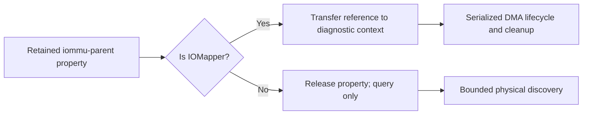

# Intel boot and GPU continuation

Current Status: Development continues from `6cdd54c1d9e9ae69e445db91dcd8ce88790a50dd`.
The operator confirmed the existing Samsung NT751XHD-KR735, Intel Core Ultra 7
255U, physical GPU `8086:7D41`, and macOS Sequoia target. Physical boot, diagnostic
kext load, native GPU execution, and system Metal remain unverified. The current
Linux build host has an ASPEED display controller, with no Intel or NVIDIA GPU.

Target State: Boot the confirmed Intel x86_64 target and demonstrate actual
driver-backed GPU submission, correct readback, and display/Metal integration.
Iris Xe and NVIDIA RTX support require separate family backends and physical
acceptance; the 255U GPU's marketing name is Intel Graphics. Recognizing an ID
does not implement a driver.

## Source and ownership

`26x86/26x86` identifies `NiSeullent/Mellow` as its vendored source repository in
`vendor/mellow-source.json`. The separate `26x86/Mellow.kext` GitHub path returned
404. The existing Sequoia branch and its source revision above are the starting
point; other NextCore worktrees and private media are not changed.

The integration owner owns the diagnostic service and this document. The GPU
reviewer owns the focused GGTT tests and `XE-GGTT-OWNER.md`. The boot reviewer is
read-only. Two build jobs at most are permitted; no physical installation,
kernel loading, reboot, or service start is included in local validation.

## Bounded changes

1. Remove a second device-mapper lookup during diagnostic service startup.
   `copyProperty("iommu-parent")` returns an owned reference. If that exact object
   is an `IOMapper`, transfer its reference into the diagnostic context; release
   any other property type and continue in query-only mode. Calling
   `copyMapperForDevice()` after the first check can observe a replacement
   indirect identifier and enter `waitForMatchingService()` without a timeout.
   The diagnostic service must never wait for such a mapper during boot.
2. Exercise the GGTT failure contracts with the production manager: stale
   ownership/generation, occupied PTEs, failed publication/invalidation/readback,
   retirement, and quarantine resource retention. Existing happy-path coverage
   alone does not establish these contracts.
3. Package a boot-baseline profile that changes only Mellow injection and its
   diagnostic boot argument. Keep CPU count, CPUID emulation, ACPI and other
   drivers identical to the default. The existing rescue profile also sets
   `cpus=1`, so it cannot isolate the Mellow variable. Verify the exact nested
   configuration changes and retain the existing rescue/memory-map alternatives.

Mapper capture is a reference-lifetime guarantee, not power/reset integration.
It does not prove that a retained mapper remains usable across device removal.
DMA remains unpublished diagnostic memory, with no GPU address-space publication.

## Validation and remaining dependencies

Run the approved host physical-probe/GGTT/CGL boundary suite, diagnostic protocol
suite under ASan/UBSan, and all Xcode target translation units through the Darwin
cross compiler. Inspect the diagnostic object for absence of the blocking
mapper helper import. These checks do not run IOKit or boot macOS.

Physical acceptance requires the exact EFI/kext build identity, the Samsung
kernel/userspace boot logs, successful physical query, and a supported device
owner with working power/reset, GGTT/PPGTT, GuC, interrupts, and completion.
NVIDIA RTX additionally needs a selected RM/GSP or Nouveau/NVK adapter and its
matching userspace/firmware contracts. No native NVIDIA implementation exists
in the current tree. Apple system Metal and WindowServer integration are still
separate unfinished components.

OPEN_QUESTION: Hardware: No test-device connection or new Samsung boot log is available in this session.
OPEN_QUESTION: NVIDIA: RTX 3080/3090 appear in the existing support matrix but have no implemented Darwin backend or physical acceptance receipt.

## Local verification, 2026-09-27

The following approved commands returned exit code zero:

```sh
python3 Tools/run-255u-tests.py --cxx clang++ --out build/continuation-20260927/host
python3 Tools/run-tahoe-diagnostic-tests.py --cxx clang++ --sanitize --out build/continuation-20260927/diagnostic
python3 Tools/cross-build.py --llvm-bin /usr/bin --output build/continuation-20260927/kext --configuration Release --compile-only
```

The host report contains three boot-profile unit tests, 111 physical-sampler
checks, GGTT success/failure lifecycle tests, and CGL rejection/lifetime checks.
The C++ host suites use ASan/UBSan. The separate diagnostic protocol suite passed
6,328 checks. All 34 Xcode-target translation units compiled into Darwin x86_64
objects. The newly compiled diagnostic object has no undefined
`IOMapper::copyMapperForDevice` reference; the earlier 0.4.4 object has one.
Two independent agent reviews found no blocking integration issue.

These are local host and static object results. No final kext linkage, new EFI
archive, IOKit execution, physical boot, GPU submission, or Metal acceptance was
performed in this verification. The prior EFI archive still contains the prior
source revision and does not include these changes. Quarantine tests retain
simulated resources during each fixture; they do not prove real device lifetime
through shutdown or reboot.

New package assembly reports the actual GitHub ref (or local branch) instead of
hard-coding the earlier Sequoia branch. Its source commit remains the primary
artifact identity, checked against the native build before assembly.


