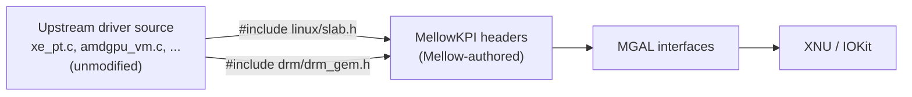

# MellowKPI — a Linux kernel API layer for XNU

> **Design draft; implementation status is separate.**
> [PLATFORM-DECISIONS](PLATFORM-DECISIONS.md) and [PLATFORM-ARCHITECTURE](PLATFORM-ARCHITECTURE.md)
> take precedence over conflicting assumptions below. [IMPLEMENTATION-STATUS](IMPLEMENTATION-STATUS.md)
> records the runnable policy/intake code. No GPU, Metal, WindowServer or display acceptance has passed.

## 한글 요약

MellowKPI는 Linux 커널의 memory·VM·lock·IRQ·fence·reset 계약을 XNU에서 구현하려는 계층이다.
FreeBSD LinuxKPI/drm-kmod는 참고 사례지만 그 결과가 Darwin에 자동 적용되지는 않는다.
헤더 치환은 선언과 빌드의 일부 문제만 해결한다. 의미 보존과 dependency closure를
검토하고 실제 adapter를 구현한 뒤에야 소스 변경을 줄이는 포팅 흐름을 만들 수 있다.
**실행 가능한 MellowKPI는 아직 없다. 소스 intake와 platform policy 구현은 별도 상태다.**

---

**Status: `PLANNED`. No `linux/*` or `drm/*` headers exist in this repository.**

## The precedent

This is not a speculative technique. FreeBSD has been running Linux GPU drivers in production for
years using exactly this approach:

- **LinuxKPI** is a compatibility layer providing Linux kernel interfaces on FreeBSD, so that
  Linux driver code runs with minor modification.
- **`drm-kmod`** packages the Linux DRM drivers — amdgpu, i915, radeon — as FreeBSD kernel modules
  on top of LinuxKPI. The ports contain FreeBSD makefiles plus **source code from Linux, patched
  minimally**.
- It tracks upstream continuously; Linux 6.7 and 6.8 drivers were merged and 6.9 porting completed
  in a single quarter of 2025.

Sources: [FreeBSD DRM drivers status report](https://www.freebsd.org/status/report-2025-04-2025-06/drm-drivers/),
[freebsd/drm-kmod](https://github.com/freebsd/drm-kmod),
[FreshPorts graphics/drm-kmod](https://www.freshports.org/graphics/drm-kmod/).

MellowKPI is the same idea targeting XNU instead of FreeBSD. The differences are real — XNU's
IOKit is C++ and object-oriented where FreeBSD's newbus is C, and macOS memory management differs
substantially — but the *shape* of the solution is proven.

## The core technique: substitute headers, not sources

Header adaptation can make declarations compile; it does not preserve Linux memory, lock, IRQ,
fence, scheduler or reset semantics. Each imported operation needs an explicit Darwin contract
and tests before the resulting driver can execute safely.

This has two consequences that matter for Mellow:

1. **Upstream tracking uses semantic review.** API signatures, call context, lifetime and ordering
   assumptions can all change; a same-named API does not waive regression tests.
2. **Licensing is reviewed per dependency closure.** Reimplementing declarations or separating
   directories does not itself resolve derivation or combination conditions. See [LICENSING.md](LICENSING.md).

Where a source edit is genuinely unavoidable, it is captured as a **patch in a series** —
`patches/<backend>/*.patch` — never as a fork of the file. This is `drm-kmod`'s convention and it
keeps the delta from upstream visible and reviewable.

## Header inventory

The set required is large but bounded, and it is discovered empirically rather than guessed: build
a target driver, collect the unresolved includes and symbols, implement, repeat. the proposed `mellow-port
doctor` would automate that loop — see [BACKPORT-PIPELINE.md](BACKPORT-PIPELINE.md).

### Core kernel

`linux/kernel.h`, `slab.h`, `mutex.h`, `spinlock.h`, `rwsem.h`, `workqueue.h`, `delay.h`,
`ktime.h`, `jiffies.h`, `atomic.h`, `bitops.h`, `bitmap.h`, `list.h`, `rbtree.h`, `idr.h`,
`xarray.h`, `kref.h`, `err.h`, `errno.h`, `string.h`, `math64.h`, `log2.h`, `sort.h`,
`completion.h`, `wait.h`, `sched.h`, `printk.h`, `module.h`, `types.h`, `compiler.h`

### I/O and DMA

`linux/io.h`, `iopoll.h`, `pci.h`, `pci_ids.h`, `dma-mapping.h`, `dma-fence.h`, `dma-resv.h`,
`dma-buf.h`, `scatterlist.h`, `firmware.h`, `interrupt.h`, `irq.h`, `iommu.h`, `vmalloc.h`,
`mm.h`, `highmem.h`

### DRM

`drm/drm_device.h`, `drm_drv.h`, `drm_file.h`, `drm_gem.h`, `drm_mm.h`, `drm_syncobj.h`,
`drm_print.h`, `drm_ioctl.h`, `drm_managed.h`, `drm_cache.h`, `drm_buddy.h`, `drm_exec.h`,
`drm_gpuvm.h`, and the `drm/ttm/*` family

### UAPI

`include/uapi/drm/drm.h` and the per-driver UAPI headers are **ingested, not reimplemented** —
their individual notices and dependency closure require review. They define structures that inform the
shape of [MELLOW-UAPI](MELLOW-UAPI.md).

## Mapping onto MGAL and XNU

MellowKPI must implement or explicitly reject Linux semantic contracts using MGAL/XNU primitives.
The following are candidate bindings, not equivalence claims; see RFC D07 for required invariants.

| Linux facility | Backed by |
| --- | --- |
| `kmalloc` / `kfree` / `kvzalloc` | `IOMalloc` family, with size tracking |
| `mutex` / `spinlock` / `rwsem` | `IOLock`, `IOSimpleLock`, `IORWLock` |
| `workqueue` / `delayed_work` | `IOWorkLoop` plus `IOTimerEventSource` |
| `wait_queue` / `completion` | `IOLockSleep` / `IOLockWakeup` |
| `readl` / `writel` / `ioremap` | `IMellowMmio` — bounds-checked, ordered |
| `pci_*` configuration and BARs | `IOPCIDevice`, via `IMellowDevice` |
| `dma_alloc_coherent`, `dma_map_sg` | `IMellowMemory` — `IOBufferMemoryDescriptor`, `IODMACommand` |
| `scatterlist` | `IODMACommand` segment lists |
| `dma_fence` / `dma_resv` | Separate completion, reservation, ownership and lock contracts; not a fence-only replacement |
| `dma_buf` | Explicit sharing/import/export/lifetime/sync adapter; IOSurface alone is insufficient |
| `request_firmware` | Kext resources or an on-disk firmware directory, hash-verified |
| `request_irq` / threaded IRQ | `IOFilterInterruptEventSource` on a workloop |
| TTM resource managers | `IMellowMemory` plus `IMellowVm` |
| `drm_mm` / `drm_buddy` | Retained as-is where possible — they are allocator algorithms with no OS dependency |

The last row is worth noting: a substantial fraction of DRM is pure algorithm — range allocators,
buddy allocators, GPU VA managers, scheduler queues — with no kernel dependency beyond locking and
allocation. Those port almost for free, and they are also the parts most likely to be correct
after porting.

The existing tree already anticipated this pattern in miniature:
[tests/iokit_types/](../tests/iokit_types) contains a hand-written `IOKit/IOMapper.h` used to
compile production source against host mocks. MellowKPI is that idea taken to its conclusion.

## Constraints specific to XNU

These are the places where the FreeBSD precedent does not transfer directly, and they are the real
engineering risk in this component.

| Constraint | Consequence |
| --- | --- |
| Kernel C++ with no exceptions or RTTI (`-fapple-kext`) | MellowKPI is C-callable; C++ is confined to the IOKit binding layer |
| No `kmem_cache` equivalent with the same semantics | Slab-style allocation is emulated over `IOMalloc`, with the size-tracking Linux callers assume |
| Interrupt context restrictions differ | Linux's hardirq/softirq split maps onto filter-function plus workloop; anything Linux does in hardirq must be audited, not assumed safe |
| No `mmap` on a file descriptor | `GEM_MMAP` becomes `clientMemoryForType` — see [MELLOW-UAPI](MELLOW-UAPI.md) |
| Kext-to-kext linking is limited | Backends are separate kexts declaring `OSBundleLibraries` on `com.NiSeullent.MellowKMD` |
| Symbol availability is gated by KPI export sets | Every MellowKPI symbol use must resolve against the target kernel's `__LINKINFO,__symbolsets` — the existing [Tools/tahoe-abi.py](../Tools/tahoe-abi.py) already checks exactly this and is reused |
| macOS SIP and kext signing | Deployment concern, documented per test environment, not solved by MellowKPI |

## Failure posture

Every unimplemented KPI function is a **stub that fails loudly** — it logs, returns an error, and
increments a counter visible to `mellow-port doctor`. It never returns a neutral success.

This follows [EVIDENCE-POLICY.md](EVIDENCE-POLICY.md), and for this component it is also the
mechanism that makes incremental porting safe: a driver running against a partially-implemented
KPI fails at the first unimplemented call, in a way that names the missing function, rather than
corrupting state and failing later somewhere unrelated.

## Scope discipline

MellowKPI implements what the targeted backends actually call — nothing more. The first target is
the subset `drm/xe` requires, because [that backend already exists in hand-written form](MGAL.md)
and can therefore be used to check the result.
