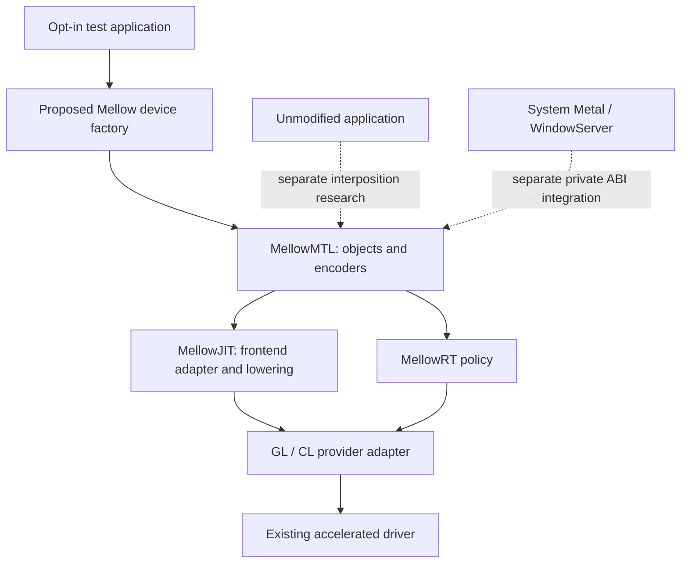

# Metal emulation: user-space object and command contracts

> **Design draft; the Metal facade is not implemented.**
> [PLATFORM-DECISIONS](PLATFORM-DECISIONS.md) and [PLATFORM-ARCHITECTURE](PLATFORM-ARCHITECTURE.md)
> take precedence over earlier design assumptions. [IMPLEMENTATION-STATUS](IMPLEMENTATION-STATUS.md)
> records the runnable policy/intake code and the separate Windows OpenCL substrate probe.

## 한글 요약

여기는 사용자 공간 API 계층이다. MellowMTL은 앱의 Metal 객체·명령·자원 계약을 구현하고,
MellowJIT와 MellowRT를 통해 검증된 GL/CL 제공자에 연결하는 목표 모듈이다.
첫 단계는 시험 앱이 명시적으로 선택하는 Mellow device factory와 offscreen compute/render이다.
일반 앱의 symbol interposition, 시스템 Metal driver 등록, WindowServer와 scanout은
각각 추가 검증이 필요한 별도 통합 단계다. 현재 Mellow-owned `MTLDevice`는 없다.

## Ownership and compiler boundary

MellowMTL owns device/resource objects, encoder validation, pipeline requests, command-buffer
state and the public error surface. MellowRT owns provider selection, dependency admission,
resource lifetime and completion policy; a provider adapter owns actual API calls and observations.

MSL input requires a separately implemented frontend contract. A version-pinned Apple SDK tool
may produce AIR for an adapter that understands that exact dialect, or an independently implemented
frontend may produce Mellow IR. Finding `GPUCompiler.framework` symbols does not establish a public,
redistributable, independently callable compiler API. Unknown AIR/metallib dialects are rejected.
See [SHADER-JIT](SHADER-JIT.md) and [AIR-ABI](AIR-ABI.md).

## Attachment stages

### 1. Explicit application opt-in

A test application links a future Mellow library and calls its own factory. Objective-C objects
implement a declared subset of the public Metal protocols. The first acceptance fixture creates
buffers, submits a compute kernel, waits for a real provider event and compares nonce-varied
readback. A second fixture renders a known offscreen pattern and compares every required pixel.

Protocol conformance alone does not establish compatibility with all framework internals or third-party
applications. Each supported selector needs an implementation, error contract and positive/negative
tests. No device-family bit is advertised merely because the object responds to a selector.

### 2. Application-specific interposition experiments

Interposing public device factories may be evaluated after the opt-in implementation works.
An application's loading policy, signing/runtime restrictions, framework caches, device enumeration
and actual factory usage determine whether this works. It is not a universal deployment mechanism.

The existing `cs_validate_page` hook in [DYLDPatches.cpp](../Mellow/DYLDPatches.cpp) does not demonstrate
that arbitrary applications can safely consume a new Metal implementation. Reusing it would require
a separate, version-scoped design and test. No interposition is enabled by this platform change.

### 3. System Metal driver integration

Historical evidence contains Apple driver bundle metadata and parts of the IOAccelerator class
hierarchy. It does not supply a complete callable ABI for a Mellow driver. Names such as
`MetalPluginClassName` are discovery clues; they do not prove selector numbers, structure layouts,
ownership rules, user-client mapping or compatibility with a particular installed OS build.

The commented bundle-search patch in [DYLDPatches.cpp](../Mellow/DYLDPatches.cpp) is retained as an
experiment, not enabled as a known-correct universal loader. Build-specific inventories and actual
traces must establish any required private interface before a bundle is registered.
See [TAHOE-ABI](TAHOE-ABI.md) and
[intel-umd-partial.json](../abi-evidence/intel-umd-partial.json) for the limited recorded inputs.

WindowServer, CoreAnimation composition, IOSurface import/export, display ownership and scanout
each require their own integration and acceptance. Loading a Metal bundle does not establish them.

## Proposed object scope

The initial target is a tested subset needed for offscreen compute and rendering, not an immediate
claim of `MTLGPUFamilyMac2` or complete Metal 2 conformance:

- device, queue, command buffer and explicit lifecycle/error transitions;
- compute/render/blit encoders with checked resource and pipeline bindings;
- buffers, textures, samplers and depth/stencil state for individually tested formats;
- libraries, functions and pipeline states for the supported shader-input dialect;
- hazard tracking, fences/events and storage modes only as their semantics are implemented.

Heaps, argument-buffer tiers, cross-process events and presentation are additional milestones.
Metal 3 features are admitted individually; a complete family claim requires all mandatory behavior
for that family. MetalFX is a separate framework integration and is not automatically provided by
implementing Metal selectors. `MTL4*` is outside the initial scope.

## Required semantics

- Preserve ordering required by the chosen queue and encoder APIs. Queue order must not be mistaken
  for unconditional cross-queue visibility or host callback serialization.
- Track read/write ranges, resource aliases, encoder stages and hazard mode. Untracked resources
  require explicit synchronization; GL and CL events do not imply cross-API storage visibility.
- Implement storage modes with their specified CPU/GPU visibility. Unsupported modes fail creation
  or compilation rather than silently changing semantics.
- Model fence/event signal and wait scopes explicitly, including any cross-queue/process support.
  Do not reduce `MTLFence` to an assumed same-buffer-only primitive.
- Propagate provider failure, reset, timeout and page fault to the command buffer. Only a valid event
  in the matching device/queue/reset epoch can authorize completion.
- Validate shader address spaces, layouts, atomics, barriers, formats and subgroup requirements before
  submission. Reject unsupported features with a stable, inspectable reason.

The policy foundation checks supplied contracts. Trusted adapters must still gather real events and
readback; callers constructing synthetic descriptors cannot turn a host policy test into GPU evidence.

## Acceptance and attribution

Existing [metal-probe.swift](../Tools/metal-probe.swift), [metal-run.py](../Tools/metal-run.py) and
[mellow_acceptance.py](../Userspace/mellow_acceptance.py) provide useful fixture ideas. Their execution
against a future Mellow device must be reviewed and recorded; compatibility is not assumed.

Require a known provider and physical-device mapping, a submitted workload, nonce-varied readback,
valid provider completion observations, negative tests, reset-generation rejection, offscreen render
verification and sustained submission tests. Driver-reported names and timestamps are observations,
not an independent physical attestation. System display acceptance remains separate.

The Windows probe in [probe-opencl-substrate.py](../Tools/probe-opencl-substrate.py) executes a small
OpenCL C kernel through an already installed host driver. It neither constructs a Metal device nor
uses MellowRT/JIT, and its result cannot satisfy the acceptance criteria of this plane.
