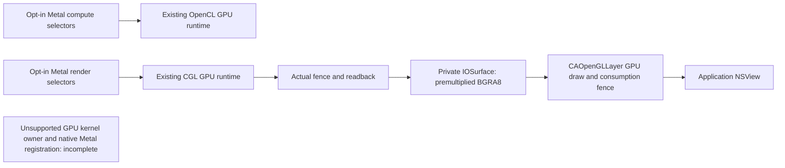

# macOS Metal selectors and application window presentation

The source now connects an explicitly selected Objective-C Metal selector subset
to the existing production GPU runtimes. It also connects completed render
readback to an application-owned IOSurface and CAOpenGLLayer. **The new native
sources have not been compiled with the Apple SDK or executed on macOS.** They
do not implement an unsupported GPU's kernel submission owner, a registered
system Metal accelerator, or a WindowServer GPU driver. The full Intel/NVIDIA
port remains incomplete.

## Implemented source

| Source | Resulting behavior |
|---|---|
| `Runtime/NativeMetalCompute.h/.mm` | Explicit compute factory; library/function/pipeline, stable shared buffer storage, encoder, ordered async submission, errors and completion handlers over actual OpenCL GPU execution. |
| `Runtime/NativeMetalRender.h/.mm` | Explicit render factory; validated native descriptors, separate stage bindings, bounded triangle commands, and snapshots correlated with actual CGL GPU completion. |
| `Runtime/WindowSurfacePresenter.h/.mm` | Main-thread view hosting, completed readback copied into a new private IOSurface, accelerated layer context, real consumption fence, resize/scale updates and teardown. |
| `Runtime/PresenterPixels.hpp` | Top-left straight RGBA8 to top-left premultiplied BGRA8, with aligned row padding and checked bounds. |
| `Tools/native-metal-client.mm` | Native integration client with independent compute/pixel expectations and observed layer fence reporting. |
| `Tools/native-metal-abi.mm` | Read-only inventory of existing system devices, declaring Objective-C classes, selector type encodings and loaded image UUIDs. |
| `Tools/NativeMetalClient.mk` | Local build-only entry point using an installed macOS SDK. It installs or registers nothing. |

The adapters deliberately implement partial selectors without declaring full
Apple protocol conformance. Unsupported selectors raise an explicit exception;
foreign resources and unsupported descriptors fail. Applications must select
the factories themselves. There is no interposition of Metal.framework,
`MTLCreateSystemDefaultDevice`, or method replacement.

Compute admits one uint32 buffer at index 0, offset 0, and an exact one-dimensional
dispatch. Stable wrapper-owned `contents` bytes are copied to the real backend
before submission and back after its verified dispatch/readback. No CPU shader
fallback is present. Scheduled callbacks are delayed until the synchronous
provider returns real submission evidence. Queue reservations preserve enqueue
order. Abandoned reservations do not create a retain cycle; destruction cancels
blocked commands with errors and wakes their completion waiters. Calling code
must obey the documented one-thread-per-command encoding contract and shared
memory synchronization rules.

Render admits one RGBA8Unorm 2D shared texture, Clear/Store, one unblended color
target and a non-indexed triangle at vertex 0 with 3 vertices. Vertex and fragment
float4 parameters are bound independently and must match. New encoding invalidates
old content; superseded work cannot publish stale pixels. `getBytes` and the
snapshot helper accept only correlated successful GPU output. There is no
shader texture sampling, depth/stencil, MSAA, indexed drawing or drawable emulation.

The two factories own separate OpenCL/CGL providers. They do not imply physical
GPU identity or compute/render interoperability. Neither a renderer string nor
an IOSurface establishes PCI ownership.



## Window contract

The presenter accepts only the render adapter's completed texture snapshots.
It copies actual GPU-produced bytes, swaps R/B and premultiplies alpha under an
IOSurface write lock. Shader outputs supplied to this path use straight alpha.
Surface row and allocation sizes use `IOSurfaceAlignProperty`; the returned
layout is checked before copying. Row zero stays at the top; the layer sampler
flips OpenGL coordinates exactly once. The layer uses linear sRGB.

The presenter requires an empty, unlayered NSView on the main thread. It sets
the layer before enabling `wantsLayer`, maintains bounds and backing scale, and
uses an accelerated no-recovery Core OpenGL context. It binds the private surface
with `CGLTexImageIOSurface2D`, establishes the required GL state and issues a
fullscreen triangle. A real GLsync must signal before successful consumption is
recorded. Timeout/failure preserves the surface and GL bindings until context
retirement. `detach` must be called on main before releasing the presenter.

A successful enqueue means only that a frame was queued. A signaled consumption
fence means that the layer context consumed it. Neither establishes successful
WindowServer composition, display scanout, or unsupported-GPU ownership. Driver
calls can block despite a bounded fence wait; native runs need an external process
timeout. The runtime never records scanout or system registration as true.

## Native build and execution

On a macOS host with the Apple SDK already installed, build without installing
anything:

```sh
make -f Tools/NativeMetalClient.mk
```

The default target is x86_64 and the minimum OS is macOS 15. `MELLOW_ARCH` and
`MELLOW_OUT` can be supplied explicitly. The default output directory includes
the target architecture and SDK version; a custom output directory must be unique
for each build configuration. Source availability does not establish
either macOS 15 or 26 compatibility; both need their own build/run record.

The resulting native programs can be run separately:

```sh
mellow_native_dir="build/native-metal-client/x86_64-sdk$(xcrun --sdk macosx --show-sdk-version)"
"$mellow_native_dir/native-metal-client" --compute
"$mellow_native_dir/native-metal-client" --render
"$mellow_native_dir/native-metal-client" --window
"$mellow_native_dir/native-metal-abi"
```

`--compute` checks eight input values, including uint32 wraparound, after real
GPU readback. `--render` checks an independently calculated interior gradient
and clear corner after a completed render. `--window` opens an application window
and checks for an actual layer consumption fence. It retains false fields for
WindowServer acceleration and scanout. These commands were **not executed in
this Linux workspace**; their output is not an existing validation receipt.

The ABI tool enumerates existing Apple system Metal devices only to identify
their loaded metadata. It never substitutes them for the adapter's execution.
It records inherited selector ownership rather than treating string presence
as ABI proof. It does not verify kernel virtual tables, private structure offsets,
or a complete Metal driver ABI. A native plugin still needs exact OS-build and
binary-UUID-bound kernel/user contracts and a real submission owner.

## Validation actually performed

The platform-independent pixel test was compiled with Clang 21, strict warnings,
AddressSanitizer and UndefinedBehaviorSanitizer and passed. It checks distinct
2×2 corners, all 256 alpha values, row padding, guard bytes and rejection of
invalid sizes/null storage. This verifies conversion logic only. Independent
agents reviewed native ownership, completion correlation, descriptor admission
and the presentation contracts; source review is not an SDK build.

The earlier source-intake regression receipt remains separate: 15 passed,
1 optional upstream-capture test skipped. It does not validate these native files.

## Full-driver work still required

For each Intel/NVIDIA family, implement and test the actual macOS kernel owner:
firmware/bootstrap, GPU VM, DMA/resource ownership, engine queues, submissions,
GPU completion, reset and display integration. OpenCL/CGL availability through an
existing driver cannot supply this missing owner for an unsupported device.

System Metal integration then needs a native accelerator service and Metal plugin,
complete compiler/resource/command contracts, and OS-specific private ABI evidence.
IOSurface producer/consumer synchronization across processes and WindowServer
display composition must be validated on the target GPU. Normal application
selector wrappers and a successfully drawn NSView do not satisfy that requirement.

## Source evidence

- [Apple Metal command-buffer contract](https://developer.apple.com/documentation/metal/mtlcommandbuffer)
- [Apple's public selector wrappers](https://github.com/apple/metal-cpp)
- [Apple CAOpenGLLayer draw contract](https://developer.apple.com/documentation/quartzcore/caopengllayer/draw(incglcontext:pixelformat:forlayertime:displaytime:))
- [Apple NSView layer-hosting contract](https://developer.apple.com/documentation/appkit/nsview/wantslayer)
- [Apple WebKit IOSurface allocation](https://github.com/WebKit/WebKit/blob/main/Source/WebCore/platform/graphics/cocoa/IOSurface.mm)
- [Apple Objective-C method type encodings](https://developer.apple.com/documentation/objectivec/method_gettypeencoding(_:))
- [Apple Metal registry identity](https://developer.apple.com/documentation/metal/mtldevice/registryid)
- [OpenNVDA pinned source, 2044adc](https://github.com/bdwithganesh/OpenNVDA/tree/2044adc11ceea642b2798b1943c292891562ae2b)

OpenNVDA's current source contains actual plugin/compiler/submission calls, but
the inspected commit relies on Sonoma-derived private layouts and an external
`nakc` compiler not verified from the referenced published build source. Its
kernel hang path can forcibly write stamps after a timeout. That path is not
imported: forced stamp writes cannot establish real GPU completion. Source
existence does not establish general AIR support or macOS 15/26 compatibility.
