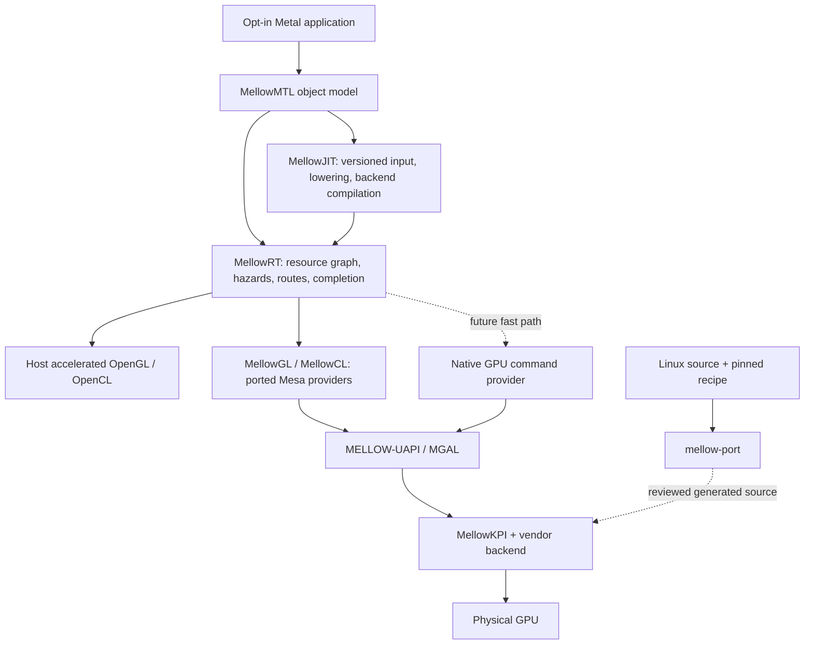

# Mellow platform architecture

Mellow — **Metal Emulation Layer Logic for OpenGL/OpenCL Workloads**.

이 문서는 확대개편의 구현 계약이다. Mellow는 Metal 애플리케이션의 명령·셰이더·자원을
자체 런타임에서 해석하고, 동작하는 OpenGL/OpenCL 제공자 또는 앞으로 구현할 native
GPU backend에 제출한다. GL/CL 제공자가 없는 장치는 Linux 드라이버를 이식한 별도
하위 스택이 먼저 필요하다. 기존 Intel Xe 코드는 이 하위 스택의 연구 자산이다.

`Runtime/`의 정책과 실제 OpenCL C provider, `Tools/mellow_port/`의 분석 도구,
`Drivers/PortedXe/`의 부분 이식은 이 계약의 일부를 구현한다. 실제 Windows OpenCL 제출과
QEMU의 알고리즘 실행, 이식 함수를 포함한 Darwin kext 빌드를 구분해 기록한다.
아래 Objective-C Metal 구현, JIT와 전체 XNU hardware binding은 설계 단계다.
실제 상태는 [IMPLEMENTATION-STATUS](IMPLEMENTATION-STATUS.md)를 따른다.
기존 작성 중인 CONCEPT/MGAL/AIR 문서는 제안 자료이며 전제 검토는
[PLATFORM-DECISIONS](PLATFORM-DECISIONS.md)를 우선한다.

## 1. Public product boundary

초기 배포 표면은 앱이 명시적으로 선택하는 `MellowCreateDevice`(예정)와
`libMellowMTL`이다. 자체 `MTLDevice`, queue, command buffer, encoder, resource,
pipeline 객체가 Metal 의미를 수행한다. 기존 `MTLCreateSystemDefaultDevice()` 호출
결과를 관찰하는 테스트 클라이언트는 이 구현을 대신하지 않는다.

목표는 기존 GL/CL 가속 활용과 미지원 장치의 가속 구축을 같은 상위 API로 제공하는 것이다.
프로젝트 이름은 실행 방향이 `GL/CL -> Apple Metal`이라는 뜻이 아니다.
MellowGL/MellowCL을 외부 OpenGL/OpenCL 애플리케이션에 제공하는 기능도 별도 제품 표면이며,
현재 두 API의 호환 라이브러리를 구현했다는 뜻은 아니다.

WindowServer/CoreAnimation 경로는 별도의 통합 단계다. 앱이 offscreen texture를
만드는 것, IOSurface를 compositor에 전달하는 것, 전체 시스템의 Metal 장치로
등록되는 것, display scanout을 소유하는 것은 서로 다른 합격 조건이다.

## 2. Module and ownership boundaries

- **MellowMTL / user space:** Objective-C object semantics, reference lifetimes, descriptor
  validation, feature-family queries and NSError mapping. System-wide interposition is not
  the initial contract; hardened process policy and private ABI are separately evaluated.
- **MellowJIT / user space worker:** input validation, specialization, MIR lowering,
  target compilation and immutable cache artifacts. No firmware or MMIO access.
- **MellowRT / user space:** command graph, provider selection, resource ownership,
  explicit interop transitions and completion delivery. A CPU reference provider is test-only.
- **MGAL / portable core:** typed device, VM, allocation, engine, queue, fence, firmware,
  display and capability interfaces. Each object carries owner identity and reset generation.
- **MELLOW-UAPI / user-kernel boundary:** versioned messages, per-client handles,
  bounded arrays, overflow checks, allocation quotas and explicit synchronization objects.
- **MellowKPI / kernel:** Linux API semantic adapters to XNU for the reviewed backend subset.
  Shared names do not establish identical memory, locking, scheduler or lifetime semantics.
- **Vendor backend / kernel and compiler adapters:** PCI match, IP discovery, firmware
  authentication, VM/PTE encoding, submission, reset and optional display implementation.
- **mellow-port / build host:** deterministic source inventory, licensing facts,
  dependency-gap analysis, reviewed transformation recipes and reproducible build inputs.

The existing `Mellow/` Lilu/Xe implementation retains its historical ABI and device scope.
Its PTE/PDE helpers now call the source-derived PortedXe encoding through one linked integration
unit. Portable policy and algorithm compilation do not attach a hardware backend to a PCI device.

## 3. Capability and execution contract

Capabilities are the intersection of physical device support, provider support, correct lowering,
resource interoperability and passing conformance for the relevant OS/driver/compiler tuple.
OpenGL/OpenCL version strings alone cannot establish this intersection.

The initial targets are deliberately small: buffer arithmetic compute; an offscreen draw with
known texture formats; buffer/texture copy with exact byte checks. Metal 2 and Metal 3 families
remain unadvertised until all requirements of the advertised family are implemented and tested.
Argument buffers, indirect commands, subgroup behavior, atomics, raster order, sparse resources,
ray tracing and mesh shading each require an explicit feature decision.

The policy code receives observations from a trusted provider adapter. Test data or a caller
setting a `verified` bit does not independently establish hardware evidence. Runtime admission
must bind the provider to its actual device and build identity, not accept arbitrary app attestations.

No automatic fallback reports a CPU result as GPU acceleration. Provider errors are preserved,
unsupported lowering returns a specific error, and diagnostic CPU runs carry a distinct route.

## 4. Resources and scheduling

Each resource records device, allocation owner, format/layout, size, storage domain,
generation, mapping state and outstanding readers/writers. Queue submission captures an
immutable descriptor snapshot; subsequent application edits cannot alter accepted commands.

For a producer on CL followed by a consumer on GL, the runtime needs both a shared-resource
mapping contract and cross-API synchronization. Sharing storage alone is insufficient.
An explicit copy path must identify staging representation, bounds, completion and ownership
transfer. If neither path preserves the workload's semantics, admission fails before submission.
The first execution implementation may reject mixed-route command buffers; a planner describing
a valid future transition is not an implemented interop backend.

Metal Shared storage still requires application/queue ordering; it does not permit unsynchronized
CPU/GPU access. Managed storage tracks CPU and GPU dirty ranges and the direction of each
synchronization. Private resources have no application CPU mapping. Memoryless semantics are
only exposed with a correct lowering; allocating ordinary persistent storage is not sufficient proof.

Submission identity includes `(device, provider, queue, epoch, sequence)`. After reset, every
previously pending token completes with an error or remains quarantined until DMA retirement
is established. An old fence value cannot complete a new epoch. Interrupt arrival only triggers
completion observation; it is not a successful fence by itself. No timeout handler invents completion.

## 5. Shader JIT design

Two inputs are planned: source MSL through a versioned, tested frontend adapter and supported
precompiled AIR/metallib through a bounds-checked container/bitcode adapter. Availability of
GPUCompiler symbols is not proof that Mellow can call a stable standalone frontend.

1. Validate length limits, container version, entry points and compiler identity before parsing.
2. Decode a supported AIR dialect or another explicit frontend output into Mellow IR (MIR).
   Preserve address spaces, resource binding, precision, atomics, subgroup and barrier semantics.
3. Specialize function constants, validate reflection against descriptors and calculate requirements.
4. Select a backend lowering: compute to a supported CL input, graphics to supported GLSL stages,
   or a future native/Mesa IR. SPIR-V is usable only when the selected provider accepts that
   environment; OpenCL support does not imply SPIR-V ingestion.
5. Compile through the provider's version-pinned compiler and validate reflection/resource limits.
6. Publish an immutable pipeline object or report a precise unsupported intrinsic/feature/version.

The cache key covers source bytes, input/container schema, frontend and backend compiler builds,
MIR schema, specialization, compile options, target device/IP, driver build and resource ABI.
Changing any field invalidates native results. A cache hit still validates the stored header,
length, digest and target tuple. Atomic publication prevents partial artifacts; worker timeout
and malformed input tests are required. No cached pipeline is evidence of GPU execution.

GPUCompiler/AIR, LLVM/SPIR-V and vendor-native formats are different ABIs. Merely extracting
LLVM-looking bytes does not implement an AIR translator. Compiler investigations must use a
corpus with arithmetic, bindings, divergent control flow, barriers, atomics, texture operations,
subgroups and numerical edge cases, including deliberate unsupported cases.

## 6. Backport factory

The intended easy workflow is `source directory + recipe -> inspect -> generate -> build -> test`.
Ease comes from reusing a previously implemented family adapter and pinned transformation rules.
New vendor or kernel contracts still need engineering before the workflow can automate them.

Every family recipe binds source commit, file hashes, selected configuration, includes, firmware
requirements, userspace winsys, target SDK/KPI version, transformations and acceptance tests.
The initial tool inspects an explicit file allowlist, emits provenance, extracts only supported
literal constants and reports unresolved requirements. Its generated CMake scaffold is not a kext.

Later compiler-assisted passes use the actual compile database and preprocessor configuration.
They classify functions and types by subsystem, resolve transitive dependencies, apply reviewed
Coccinelle/Clang transformations and produce source-location diagnostics. Regex observations
are useful for intake but cannot prove semantic API coverage or link readiness.

The KPI coverage unit is a semantic contract, not a function name: DMA map/unmap and cache
maintenance; VM invalidation ordering; IRQ context restrictions; lock/RCU lifetime; waitqueue
cancellation; firmware reset; fence and reservation-object ownership. Missing contracts fail the
build/readiness gate rather than returning successful no-op values.

No automatic tool runs untrusted Makefiles during inventory, guesses PCI IDs or accepts a Linux
ELF `.ko` as a Darwin Mach-O kext. Source redistribution and binary linking require per-file
license/dependency review. Existing LICENSE/NOTICE and firmware licenses remain attached.

## 7. Device expansion strategy

- **Intel 8086:7D41:** reuse existing Xe parsing and state machines; implement one real PCI owner,
  VM/DMA/GuC/reset/IRQ adapter and its userspace compiler interface before claiming acceleration.
- **RTX 3080 / RTX 3090:** investigate separately the NVIDIA RM/open-module path with matching
  GSP and user-space ABI, and the Nouveau/Mesa NVK path. Their kernel/user ABIs are not
  interchangeable. No GPU or OpenCL support is inferred from a kernel source match.
- **RX 9070:** investigate the applicable amdgpu IP/firmware/display code and a compatible Mesa
  userspace/compiler stack. Reuse the DRM-shaped contract only where the exact semantics match.
  Device stepping, firmware and PCI/subsystem identity must come from captured hardware data.

These are research targets. None currently has a Mellow Metal acceleration pass. Linux upstream
support establishes a source/reference path, not macOS driver readiness.

## 8. Delivery and acceptance order

1. **Portable foundation (this change):** test routing restrictions, reset epochs, cache identity
   and intake/gap-report generation. These policy observations are explicitly host/synthetic.
2. **One accelerated host provider:** enumerate real GL/CL capabilities, execute compute and draw,
   bind results to the actual GPU, test explicit failure and timeouts. No new kernel driver needed.
   A native C++ OpenCL provider now executes direct OpenCL C through MellowRT on Windows.
   It does not implement Metal translation; draw, GL interop and physical PCI ownership attribution
   remain open. The earlier standalone probe is retained as separate historical substrate evidence.
3. **One shader subset and opt-in Metal facade:** parse supported compiler output, lower it,
   create real Metal-style pipeline/command objects and compare GPU results against CPU references.
4. **First ported backend:** bind 7D41 hardware, firmware authentication, VM residency,
   real submissions/fences and reset teardown; run the same frontend tests on this provider.
5. **Second vendor:** prove the abstraction supports a distinct memory/compiler/submission model;
   turn reviewed changes into a reusable family recipe.
6. **System graphics:** private driver ABI registration, IOSurface/compositor synchronization,
   display/scanout, WindowServer, suspend/resume and multimonitor tests as distinct milestones.

Host unit tests, successful compilation, firmware hash checks, API enumeration, GPU execution,
shader correctness, visual output and system integration have separate status fields. A release
must identify which stages ran on which OS/compiler/driver/device tuple and link the artifacts.
