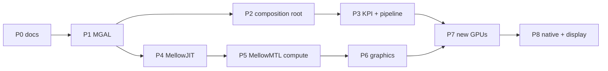

# Roadmap

> **Scope and precedence:** [PLATFORM-DECISIONS](PLATFORM-DECISIONS.md),
> [PLATFORM-ARCHITECTURE](PLATFORM-ARCHITECTURE.md), and
> [IMPLEMENTATION-STATUS](IMPLEMENTATION-STATUS.md) govern conflicting draft assumptions.
> Runtime policy and source-intake tools are runnable; the Metal facade, shader JIT, live GL/CL
> providers and integrated XNU GPU backend are not implemented. No Mellow GPU/Metal PASS exists.

## 한글 요약

P0부터 P8까지의 목표 순서와 완료 기준. 새 정책/intake 코드는 이미 실행 가능하며,
단계별 실제 완료 여부는 IMPLEMENTATION-STATUS와 실험 기록을 따른다. 순서는 **각 단계가 아래 단계 없이도 독립적으로
검증 가능하도록** 정했다. 특히 두 단계가 중요하다 —
**P3**은 검토한 upstream 의미와 회귀 입력으로 포팅 recipe를 시험한다. 미검증 Xe는 정답지가 아니다.
**P4**는 검증한 기존 GPU driver/compiler 경로를 이용한 AIR/MIR→CL C 부분집합부터 시작하고,
SPIR-V IL은 제공자의 IL 지원 확인 후 활성화한다. 어떤 단계도 `F` 등급 시험 없이 능력 비트를 켜지 않는다.

---

Evidence levels are defined in [EVIDENCE-POLICY.md](EVIDENCE-POLICY.md). No phase may declare
completion at a level higher than its tests support.

## Ordering principle

The sequence is chosen so that **each phase is verifiable without the phases after it**, and so
that the two highest-risk ideas in the project — the backport pipeline and the shader JIT — are
each proven early against a known-good reference.

P4 branches early on purpose: it depends on nothing in the kernel path and can proceed in parallel.

## Phases

### P0 — Architecture baseline and policy contracts

The architecture baseline is documented. Runnable Runtime policy and source-intake tools now
exist; this does not mark kernel/provider/JIT phases complete. See IMPLEMENTATION-STATUS.

- Rewrite [README.md](../README.md), [ARCHITECTURE.md](ARCHITECTURE.md),
  [METAL_FEATURE_MATRIX.md](METAL_FEATURE_MATRIX.md), [PORTING_STATUS.md](PORTING_STATUS.md).
- Add the sixteen new documents listed in [REPO-LAYOUT.md](REPO-LAYOUT.md).
- Banner existing records as historical without editing their bodies.

**Done when:** applicable tests pass; links resolve; every hardware claim names its execution path
and evidence. The Windows OpenCL substrate probe is separate from Mellow execution.

### P1 — MGAL extraction and identity consolidation

- Extract the nine MGAL interfaces from the existing `Xe*` ops structs
  ([MGAL.md](MGAL.md) has the module-by-module mapping).
- **Collapse the 39 hardcoded `7D41` literals across 26 files into one device descriptor table.**
- Reconcile the two rival submission stacks (`SubmissionQueue` versus `EvidenceExecution`), and
  bring `XeMemorySubmission.hpp` and `XeInterruptDispatch.hpp` into the kext include closure or
  delete them.
- Execute the legacy three-way split in [LEGACY-DISPOSITION.md](LEGACY-DISPOSITION.md), salvaging
  hardware data before deletion.
- Reorganize the tree per [REPO-LAYOUT.md](REPO-LAYOUT.md).
- Add [Tools/run-xe-tests.py](../Tools/run-xe-tests.py) to CI — it is currently not run there.

**Done when:** host tests produce identical results before and after; no literal device ID exists
below `IMellowDevice`; the build output is byte-comparable modulo the intended changes.

### P2 — Composition root and MELLOW-UAPI

The central gap. Nothing in the tree currently constructs the Xe objects.

- Build the `MellowKMD` provider that owns one reset epoch: match, map MMIO, build VM, load
  firmware, attach interrupts, create queues, publish the user client, tear down in reverse.
- Implement the `*Proofs` structs the existing bindings require.
- Implement [MELLOW-UAPI](MELLOW-UAPI.md) as an `IOUserClient`.
- Revive the `IOResources` personality at [Mellow/Info.plist](../Mellow/Info.plist) by
  implementing the `IOService` subclass currently commented out at
  [Mellow/kern_start.cpp:52](../Mellow/kern_start.cpp).

**Done when:** a user-space probe reaches the kernel and back; `BackendOwnerIntegrated` can be set
on evidence rather than assertion; hardware readiness advances past `physical-provider`.

### P3 — MellowKPI and the backport pipeline

- Implement the MellowKPI subset that `drm/xe` requires ([MELLOWKPI.md](MELLOWKPI.md)).
- Extend existing `inspect`/`plan`/`generate` source-review tooling into reviewed semantic recipes
  and real Darwin bindings ([BACKPORT-PIPELINE.md](BACKPORT-PIPELINE.md)).
- **Regenerate the `xe` backend from upstream Linux source.**

**Done when:** the generated backend passes the same host tests as the hand-written one, and
`mellow-port doctor` reports its coverage honestly.

The hand-written implementation is a regression input, not a hardware-validated oracle.
Compare pinned upstream contracts, negative tests and later physical execution evidence.

### P4 — MellowJIT, compute path *(parallel with P2/P3)*

- Complete the AIR investigation in [AIR-ABI.md](AIR-ABI.md).
- Implement versioned AIR ingestion, MIR and restricted OpenCL C lowering for the J1 scope in
  [SHADER-JIT.md](SHADER-JIT.md).
- Validate on an admitted accelerated provider with a supported compiler path. SPIR-V IL is a
  separate capability-gated adapter, not the Apple CL 1.2 default.

**Done when:** a Metal compute function compiled through MellowJIT produces byte-exact expected
results through `OpenCL.framework`, with randomized inputs and guard regions.

This is the cheapest proof of the project's most novel claim. It requires no Mellow kernel code, no
new Mellow hardware driver, or private system ABI for the opt-in host path. Failure identifies a
specific compiler/provider contract; it does not decide all independent native-driver research.

### P5 — MellowMTL, interposition and compute

- Implement the MellowMTL core object model and the interposition adapter
  ([METAL-EMULATION.md](METAL-EMULATION.md), Strategy B).
- Implement the MellowRT router and resource model for the `cl` route
  ([WORKLOAD-RUNTIME.md](WORKLOAD-RUNTIME.md)).

**Done when:** the existing acceptance harnesses —
[Tools/metal-probe.swift](../Tools/metal-probe.swift),
[Tools/metal-run.py](../Tools/metal-run.py),
[Userspace/mellow_acceptance.py](../Userspace/mellow_acceptance.py) — pass end to end against a
Mellow-provided `MTLDevice`, with device attribution satisfied and CPU fallback excluded.

The first real "Metal running through Mellow".

### P6 — Graphics

- GLSL lowering (J3/J4 in [SHADER-JIT.md](SHADER-JIT.md)).
- The `gl` route and OpenGL provider.
- IOSurface interop and drawable presentation.

**Done when:** offscreen render conformance passes — geometry, interpolation, sampling, blending,
depth/stencil — with per-pixel comparison against references.

### P7 — New GPUs

- Generate the `amdgpu` backend; bring up **RX 9070 (Navi 48)**.
- Select and implement a reviewed NVIDIA RM or Nouveau/Mesa adapter for **RTX 3080 / 3090**;
  firmware, winsys and userspace must match that UAPI, not mix across adapter families.
- Port the Mesa-derived `libMellowGL` / `libMellowCL` providers onto MELLOW-UAPI.
- Firmware fetch-and-verify per vendor.

**Done when:** each GPU reaches `Execution` on the readiness ladder — one submitted job, one
interrupt, one fence observed to progress — on real hardware.

This is where the second half of the thesis in [CONCEPT.md](CONCEPT.md) is tested: a GPU macOS has
no driver for, executing a bounded native job. Metal workloads additionally require the verified
provider/compiler/API path; one job and fence do not establish Metal support.

### P8 — Native path, display, Metal 3 subset

- The `native` route: direct submission through MGAL, bypassing GL/CL.
- Display ownership and modeset.
- Metal 3 features, individually gated.

## Standing rules

1. Each phase ends in a commit and an experiment record.
2. If a step fails, the next change targets **that failure boundary** rather than broadening the
   patch set.
3. No capability bit is exposed before its conformance test passes at level `F`.
4. No phase raises an evidence level that its tests do not support.
5. [GPU-SUPPORT-MATRIX.md](GPU-SUPPORT-MATRIX.md) records outcomes; this document records
   intentions. They are kept separate deliberately.
