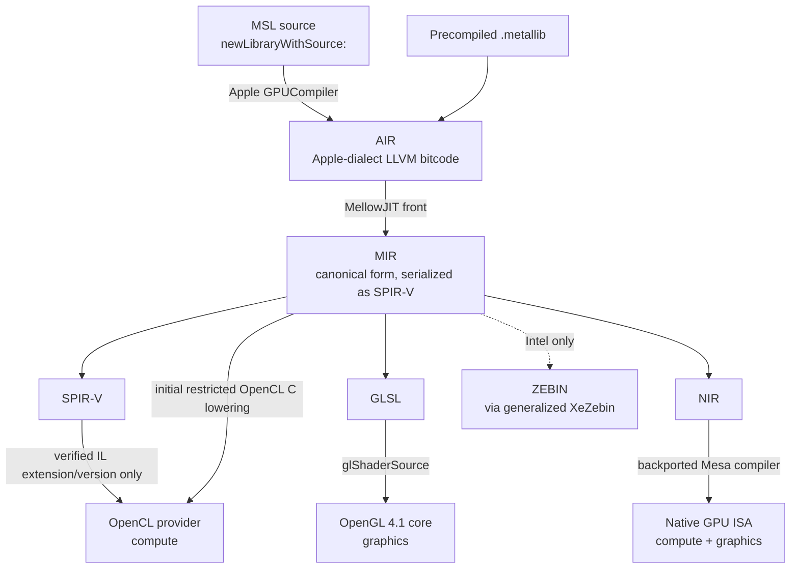

# MellowJIT — the shader path

> **Design draft; implementation status is separate.**
> [PLATFORM-DECISIONS](PLATFORM-DECISIONS.md) and [PLATFORM-ARCHITECTURE](PLATFORM-ARCHITECTURE.md)
> take precedence over conflicting assumptions below. [IMPLEMENTATION-STATUS](IMPLEMENTATION-STATUS.md)
> records the runnable policy/intake code. No GPU, Metal, WindowServer or display acceptance has passed.

## 한글 요약

Metal 셰이더는 MSL로 작성되어 AIR(Apple 방언 LLVM bitcode)로 컴파일된 뒤 metallib에 담긴다.
**SDK AIR adapter를 먼저 검증한다. GPUCompiler 심볼만으로 standalone MSL frontend를 가정하지 않는다.**
MellowJIT는 AIR를 읽어 MIR(정규 직렬화는 SPIR-V)로 옮기고, 거기서 대상에 맞게 내린다 —
compute는 기본적으로 제한된 OpenCL C lowering, IL 지원 확인 후 SPIR-V로 연결한다.
graphics는 검증된 GLSL subset, native 경로는 별도 compiler/backend 계약을 요구한다.
단계는 compute 전용 → 단순 graphics → 전체 순으로 나누며 각 단계는 적합성 시험으로 게이팅한다.
**현재 shader compiler는 없다. 별도의 cache/policy 계약 코드는 IMPLEMENTATION-STATUS에 기록한다.**

---

**Status: shader translation is planned. PlatformRuntime cache identity/policy contracts exist;
see [IMPLEMENTATION-STATUS](IMPLEMENTATION-STATUS.md). They do not compile or execute shaders.**

## The front end is not our problem

This is the discovery that makes Metal emulation tractable.

The previous plan named the missing shader front end as the blocking obstacle:

> *"no Metal-to-IGC front end was built"* — [IOACCEL-METAL.md](IOACCEL-METAL.md)

But the macOS ABI survey found that `Metal.framework` links
`GPUCompiler.framework/Versions/32023/libllvm-flatbuffers.dylib` and `libGPUCompilerUtils.dylib`,
and defines `MTLCompiler`, `MTLAirEntry`, `MTLBinaryKey`, `MTLBufferRelocation`, and
`MTLConstantRelocation`
([abi-evidence/tahoe-graphics-inventory.json](../abi-evidence/tahoe-graphics-inventory.json)).

Apple SDK tools can produce AIR on a configured build machine. Mellow needs a versioned input
adapter and must validate language semantics. Runtime MSL requires a verified compiler path or
separately implemented frontend; class names do not prove that path.

That IR is AIR: LLVM bitcode in an Apple dialect, carrying `air.*` intrinsics and Apple metadata.
It is well-formed bitcode — public tooling has demonstrated extracting `.air` from `.metallib` and
recompiling it with stock LLVM. See [AIR-ABI.md](AIR-ABI.md) for what is and is not known about
the format.

## Pipeline

### Stage 1 — AIR ingestion

Read the metallib container, extract each function's AIR module, and recover the reflection
metadata Metal attaches: entry-point kind (vertex / fragment / kernel), argument bindings and
their indices, threadgroup memory requirements, and specialization constants.

### Stage 2 — MIR

MIR is the canonical intermediate. It is serialized as **SPIR-V**, chosen deliberately rather
than inventing a format:

- SPIR-V IL requires a supported IL version and `clCreateProgramWithIL` (OpenCL 2.1+) or
  `cl_khr_il_program`; it is not the default Apple OpenCL 1.2 path. Initial host lowering is OpenCL C.
- Mesa's `spirv_to_nir` converts it to NIR, which is the entry point for every Mesa backend
  compiler — so the native path is reachable from the same IR.
- SPIRV-Cross converts it to GLSL, so the OpenGL path is reachable too.
- It is a stable, specified, testable format, which matters for a JIT whose correctness is hard to
  eyeball.

### Stage 3 — lowering

| Target | Consumer | Used for |
| --- | --- | --- |
| SPIR-V | Capability-gated IL entry point | Compute only on verified IL providers |
| OpenCL C | `clCreateProgramWithSource` | Initial restricted host compute subset |
| GLSL | `glShaderSource` on OpenGL 4.1 core | Graphics, on the host provider |
| NIR | Backported Mesa compiler for the target GPU | Both, on the Mellow provider |
| ZEBIN | Intel EU, via a generalized `XeZebin` | Intel native path only |

## Prior art

None of these stages is unprecedented, which is the point.

| Direction | Project | Relevance |
| --- | --- | --- |
| AIR to SPIR-V | `metal2vulkan` | Directly the Stage 1/2 problem |
| SPIR-V to GLSL | SPIRV-Cross | Stage 3, graphics |
| SPIR-V to NIR | Mesa `spirv_to_nir` | Stage 3, native |
| GL to Vulkan | Zink | Demonstrates API-level translation is viable in production |
| Vulkan to Metal | MoltenVK | The same problem in the opposite direction |

What has not been built publicly is the *combination* — Metal down to GL/CL. That is the novel
part of this project, and it is why the staging below is conservative.

## Staging

The AIR-to-MIR translation is the highest-risk component in Mellow. It is split so that failure is
attributable and so that early stages are useful on their own.

| Stage | Scope | Validation |
| --- | --- | --- |
| **J1** | Compute only. Scalar and vector arithmetic, buffer arguments, `thread_position_in_grid`, no barriers | Run on an admitted accelerated CL provider with a supported compiler path; no Mellow kext required |
| **J2** | Compute with threadgroup memory, barriers, atomics, SIMD-group operations | Contended and adversarially-scheduled tests with exact expected totals |
| **J3** | Graphics: vertex and fragment, interpolation, simple sampling | Offscreen render, per-pixel comparison against a reference |
| **J4** | Textures, samplers in full, argument buffers Tier 1, depth/stencil, blending | Table-driven per-format round trips |
| **J5** | Remaining Metal 2 surface | Full Metal 2 conformance subset |

**J1 is the critical early milestone for the whole project**, because it validates the hardest new
idea on a specifically admitted host/compiler combination. Passing one compute corpus proves
that subset only, not full Metal support or compatibility on every Mac.

## Caching

Compilation happens at pipeline-state creation, which is latency-sensitive. Two tiers:

- **In-process**, keyed by AIR module hash plus specialization constants.
- **On-disk**, keyed by `(AIR hash, backend identifier, backend driver version, MellowJIT version)`.

The disk cache is invalidated whenever any key component changes. A stale cache entry that
produces wrong GPU results is exactly the kind of silent failure
[EVIDENCE-POLICY.md](EVIDENCE-POLICY.md) forbids, so the key includes everything that can change
the output.

## Correctness posture

- A shader that MellowJIT cannot translate **fails pipeline-state creation** with a populated
  `NSError`. It is never silently replaced with a stub, a pass-through, or a CPU implementation.
- Unsupported constructs are enumerated explicitly and reported, so that gaps are visible in the
  feature matrix rather than discovered as rendering artifacts.
- Every stage above ships with its conformance tests before the corresponding capability bit is
  exposed.

## Relationship to the existing compiler work

The tree already contains a real, executed compiler harness:
[Tools/metal-offline-compile.py](../Tools/metal-offline-compile.py) drives Intel's official
`ocloc` 26.27.39122.11 and IGC 2.38.2 to compile `metal-evidence.cl` for `-device 0x7d41`,
producing a 6,944-byte ZEBIN and 1,636-byte SPIR-V with verified EU disassembly
([compiler-evidence/compiler-report.json](../compiler-evidence/compiler-report.json)).

This is **OpenCL C to Intel EU code**. It is not the Metal path, and the two use unrelated test
vectors. Its value to MellowJIT is as a reference implementation of the last stage on Intel — it
shows what a correct ZEBIN for this device looks like — and as the source of the ZEBIN parser in
[Mellow/XeZebin.cpp](../Mellow/XeZebin.cpp).

`XeZebin` itself is well-built but hardcoded to a single kernel: it requires exactly one text
section named `.text.mellow_evidence` and exactly eight arguments. Generalizing it is a
prerequisite for the Intel native path, and is scheduled with that work rather than with J1.
