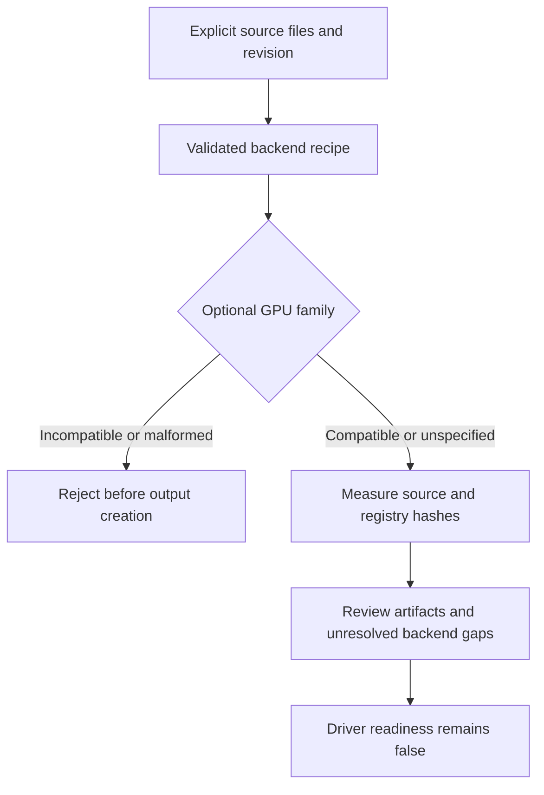

# GPU family source planning

Mellow now validates an explicitly selected GPU family against a source backend.
This implements source intake and rejection policies. It does not implement a
new native GPU driver, load firmware, widen a kext PCI match or advertise Metal.

## Selecting a source backend

The CLI reads its target choices from
[backend-recipes.json](../porting/backend-recipes.json). The same validated
registry is used by the planning API, preventing the CLI and planner from
maintaining different lists.

| Target | Recorded adapter | Family references |
| --- | --- | --- |
| `i915` | `intel-i915` | Ice Lake; Tiger/Rocket/Alder/Raptor Lake; DG1/DG2 |
| `xe` | `intel-xe` | Tiger/Rocket/Alder/Raptor Lake; DG1/DG2; Meteor/Arrow/Lunar Lake; Battlemage |
| `nouveau` | `nouveau-nvk` | Maxwell/Pascal/Volta/Turing/Ampere/Ada; consumer Blackwell |
| `nvidia-open` | `nvidia-rm` | Turing/Ampere/Ada/Blackwell; pre-Turing rejected |
| `amdgpu` | `amdgpu` | Existing source intake retained; no family profile added in this change |

The optional `--gpu-family` accepts the exact keys in
[gpu-families.json](../porting/gpu-families.json). These 18 initial entries are
source references, not an exhaustive device catalogue. Older Intel GT1/Atom
variants and unlisted future GPU generations need reviewed profiles. Ice Lake
is not classified as uniformly unsupported by macOS.

For example, `--target nouveau --gpu-family nvidia-maxwell` selects the Nouveau
source-planning contract. `--target nvidia-open --gpu-family nvidia-maxwell`
fails before an output directory is created. A selected Nouveau driver file is
required; common headers alone do not identify that backend. Mixing RM and
Nouveau source paths is rejected.

Existing callers can omit `--gpu-family`. Their output explicitly records a
null family and null source compatibility rather than inferring a GPU from
the file name, vendor string or caller-supplied revision.

## Reviewing generated artifacts

`inspect`, `plan` and `generate` include `adapter_contract` in the source
manifest and plan. `generate` also includes it in `backend.json`. A selected
profile records the measured registry SHA256, descriptive profile and source
compatibility; it always records `runtime_device_admitted=false` and
`physical_gpu_verified=false`.

Recipe-specific firmware, userspace and source-provenance gaps remain
unimplemented or unresolved. The provided source revision remains a claim;
only selected file hashes are measured. Registry hashing does not verify
upstream membership or firmware authenticity.

`driver_ready` remains false, implemented entry points and admitted PCI IDs
remain empty, and `--require-ready` exits 2 after creating review artifacts.
An ordinary successful intake exit means only that review artifacts were
written. The helper still does not translate driver functions or build a
native backend.



## Reproducing the software checks

From the Mellow checkout:

```bash
PYTHONDONTWRITEBYTECODE=1 /usr/bin/python3 -m unittest discover -s tests -p 'test_mellow_port.py'
```

The suite exercises every registered family/source pair, wrong-vendor and
pre-Turing RM rejection, mixed adapter sources, deterministic output, malformed
registries, structured CLI rejection and the closed readiness gate. Temporary
fixtures are synthetic and do not execute a GPU. An optional real pinned Xe
capture test is skipped when that separate local capture is unavailable.

Native progress must implement family-specific device ownership, DMA/GPU VM,
firmware, submission, interrupts/fences, reset, compiler and userspace ABI,
followed by physical readback and display/Metal acceptance for each OS/device.
The [Intel contract](INTEL-BACKEND-CONTRACT.md) and
[NVIDIA contract](NVIDIA-BACKEND-CONTRACT.md) record the current requirements and
primary sources.
