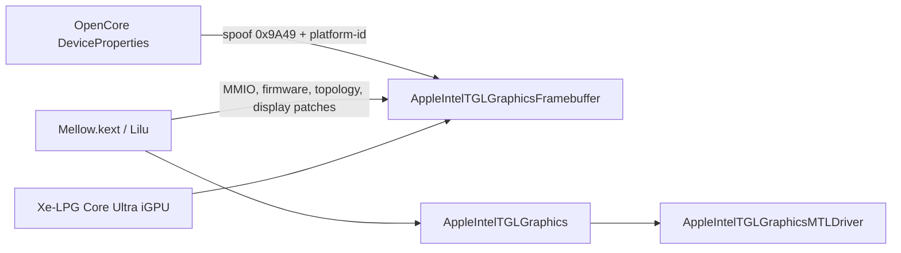

> **Historical record — preserved unedited.** This document predates the MELLOW
> re-architecture. It is retained because the record of what was known, and when, is itself
> evidence. For the current concept and architecture see [CONCEPT.md](CONCEPT.md) and
> [ARCHITECTURE.md](ARCHITECTURE.md); for what any of it is allowed to claim, see
> [EVIDENCE-POLICY.md](EVIDENCE-POLICY.md).

# Mellow

Mellow is an experimental Lilu plug-in for Intel Core Ultra integrated graphics. It adapts Apple's Tiger Lake Gen12 graphics stack to Meteor Lake and Arrow Lake iGPUs, with the initial bring-up centered on `8086:7D41` (Arrow Lake-U, Core Ultra 7 255U).

> [!WARNING]
> Intel Xe-LPG graphics are not supported by macOS. Mellow is research software: booting, display output, QE/CI, Metal, sleep/wake, and system stability are not guaranteed. Keep a known-good EFI and a recovery path.

Mellow is intentionally **not** a drop-in replacement for NootedGreen. Its supported scope is Core Ultra iGPUs only; NPU/Intel AI Boost support and general Haswell-through-Raptor-Lake compatibility are out of scope.

Current implementation evidence and the staged validation protocol are tracked
in [porting status](docs/PORTING_STATUS.md), [architecture](docs/ARCHITECTURE.md),
the [Metal feature matrix](docs/METAL_FEATURE_MATRIX.md), and
[experiments](docs/EXPERIMENTS.md). A build or visible desktop is not recorded
as Metal acceleration evidence.

## Design



The first hardware target is:

- Intel device `8086:7D41` at PCI `00:02.0`
- Intel Core Ultra 7 255U, family 6 model `0xB5`
- TGL spoof identity and platform ID `0x9A49`
- ADL-P DMC policy as the initial Display 13-compatible baseline

Mellow accepts only the following physical CPU-model/device-ID pairs. Injecting
a supported-looking property does not bypass this hardware gate.

| Core Ultra family | CPU model | Physical Intel iGPU IDs |
| --- | --- | --- |
| Meteor Lake-L | `0xAA` | `0x7D40`, `0x7D45`, `0x7D55`, `0x7DD5` |
| Meteor Lake | `0xAC` | `0x7D40`, `0x7D45`, `0x7D55`, `0x7DD5` |
| Arrow Lake-U | `0xB5` | `0x7D41` (primary target) |
| Arrow Lake-H | `0xC5` | `0x7D51` |
| Arrow Lake-S | `0xC6` | `0x7D67` |

## Boot arguments

The recommended initial bring-up arguments are:

```text
-MellowDebug -mellowtglwithgfx mellow-dmc=adlp
```

`-mellowtglwithgfx` is the canonical mode: it requests both the TGL framebuffer
and accelerator paths. `mellow-dmc` accepts the exact values `adlp`, `tgl`,
`icl`, or `skip`. If the argument is absent, Mellow defaults to `adlp`; an
invalid value safely falls back to `skip` instead of guessing.

In this first public baseline, `adlp` and `tgl` select experimental MMIO and
power-well compatibility profiles while retaining Apple's original CSR
initializer as a fallback. They do not load or redistribute a modified Intel
DMC image, and firmware initialization on Xe-LPG remains unverified.

`-mellow7d41timings` enables board-specific display timing writes for the
initial `7D41` test machine. It is intentionally opt-in and should not be used
as a general Arrow Lake-U default. Diagnostic arguments inherited from the
research baseline remain experimental and may be removed as the Ultra-only
port is reduced.

Mellow uses only its new argument namespace; legacy aliases are intentionally not accepted.

| Previous argument | Mellow argument |
| --- | --- |
| `-NGreenDebug` | `-MellowDebug` |
| `-ngreentglwithgfx` | `-mellowtglwithgfx` |
| `-ngreentglfb` | `-mellowtglfb` |
| `-ngreentglgfx` | `-mellowtglgfx` |
| `ngreen-dmc=skip\|tgl\|adlp\|icl` | `mellow-dmc=skip\|tgl\|adlp\|icl` |
| `ngreenSched=N` | `mellowSched=N` |
| every other `-ngreen*` / `ngreen*` diagnostic | the same suffix under `-mellow*` / `mellow*` |

## OpenCore baseline

Inject the TGL spoof identity through OpenCore `DeviceProperties` for `PciRoot(0x0)/Pci(0x2,0x0)`:

- `device-id` (`Data`): `499A0000`
- `AAPL,ig-platform-id` (`Data`): `0000499A`

Do not load WhateverGreen alongside Mellow during initial bring-up. Add `Lilu.kext` before `Mellow.kext` in `Kernel -> Add`, and keep a disabled or removable entry until a CI-built kext is available.

## Building

Requirements:

- Xcode on macOS
- the included Lilu development bundle
- the included MacKernelSDK

Build the Release configuration with:

```sh
xcodebuild -project Mellow.xcodeproj -scheme Mellow -configuration Release CONFIGURATION_BUILD_DIR=build/Release
```

GitHub Actions runs the same Release scheme on `macos-14` and uploads `Mellow-Release.zip`, containing `Mellow.kext`.

## Attribution and license

Mellow is a modified derivative of [ChefKiss NootedGreen](https://github.com/ChefKissInc/NootedGreen) and the [NootedGreen-UHD730 development line](https://github.com/yanyantukebo1224/NootedGreen-UHD730). It is independently maintained and is not endorsed by those projects or their contributors. See [NOTICE](NOTICE) for the full attribution notice.

Mellow-authored and NootedGreen-derived portions are distributed under the
unmodified [Thou Shalt Not Profit License 1.0](LICENSE). In accordance with
section 17, this project is non-profit and derives no revenue from distribution,
support, or related services. Vendored and APSL-covered components retain their
own licenses as listed in [NOTICE](NOTICE) and [LICENSES](LICENSES).
