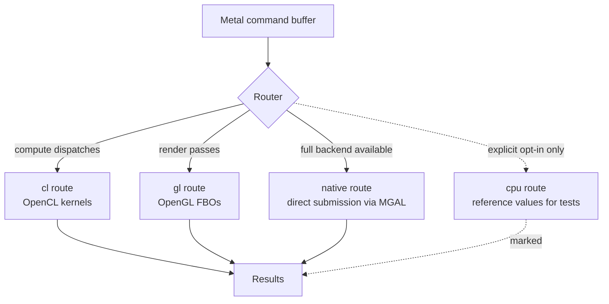

# Plane 3 — MellowRT, the workload runtime

> **Design draft; implementation status is separate.**
> [PLATFORM-DECISIONS](PLATFORM-DECISIONS.md) and [PLATFORM-ARCHITECTURE](PLATFORM-ARCHITECTURE.md)
> take precedence over conflicting assumptions below. [IMPLEMENTATION-STATUS](IMPLEMENTATION-STATUS.md)
> records policy/intake, the native Windows OpenCL provider, portable Xe tests and kext build evidence.
> Standalone OpenCL probes and MellowRT provider execution have separate records; no Metal, WindowServer
> or display acceptance has passed. Native macOS GPU execution remains unverified.

## 한글 요약

MellowRT는 자원 모델을 소유하고, command buffer 단위로 어느 기판이 작업을 실행할지 고른다.
목표 설계의 제공자는 두 종류다. **Host provider**는 이미 설치된 GPU 드라이버의 API를 쓰며,
현재 native OpenCL adapter는 Windows에서 실행됐다. macOS의 Apple GL/CL 연결은 별도 검증이
필요하다. **Mellow provider**는 Mesa 파생 `libMellowGL`/`libMellowCL`을 MGAL 위에서 실행하는
미구현 목표다.
라우팅 경로는 `cl`/`gl`/`native`/`cpu`이며, **`cpu`는 시험용 참조값 전용으로 명시적 opt-in 없이는
도달할 수 없고 그 경로로 완료된 작업은 반드시 관측 가능하게 표시된다.**
IOSurface import/export는 format·소유권·동기화 계약을 별도로 검증한다.
**현재 OpenCL C compute provider는 구현·실행됐고, Metal facade/JIT/GL/IOSurface는 미구현이다.**
정확한 실행 범위와 기록은 IMPLEMENTATION-STATUS를 따른다.

---

**Current: PlatformRuntime policy contracts and a native OpenCL C provider execute bounded GPU
compute on Windows. Metal command-buffer routing, JIT, OpenGL and compositor integration below
remain design contracts. See [IMPLEMENTATION-STATUS](IMPLEMENTATION-STATUS.md).**

## Implemented native host boundary

[Runtime/OpenCLProvider](../Runtime/OpenCLProvider.md) dynamically loads the installed host OpenCL
driver. The acceptance executable links this adapter with PlatformRuntime. After a bounded
bootstrap witness, explicit `OpenClC` steps pass through `planWorkload()` and actual event
observations pass through `CompletionTracker`; enqueue, queue/context ownership, result bytes,
ordered profiling and cleanup are checked before accepting completion.

The current API admits bounded OpenCL C source, one kernel entry and one in-place uint buffer.
It requests GPU devices and does not switch to a CPU device after failure. Windows execution
used the driver-reported `8086:7D41`; this query is not independent physical PCI attribution.
Linux/macOS loader code exists but has no host execution acceptance from the Windows result.
This provider requires Intel device-attribute identity in its first version; it is not generic
AMD/NVIDIA support. Default Metal input remains unsupported because no MSL/AIR compiler exists.

The earlier standalone substrate probe bypassed MellowRT. Its record remains distinct from this
native adapter's runtime planning and completion evidence. Both use the installed host driver;
neither loads Mellow's Darwin kext, provides scanout or establishes reset/reboot stability.

## What this plane owns

Three responsibilities:

1. **The resource model** — mapping Metal's buffers, textures, heaps, and storage modes onto
   whatever the selected provider offers.
2. **Routing** — deciding, per command buffer, which substrate executes the work.
3. **Interop** — moving pixels between providers, Metal-emulated textures, and the compositor.

## Provider kinds

The following table describes the target macOS architecture from [CONCEPT.md](CONCEPT.md).
It is not the implementation inventory; the Windows host adapter above is the current execution path.

| | Host provider | Mellow provider |
| --- | --- | --- |
| Backing | Apple `OpenGL.framework` (4.1 core), `OpenCL.framework` | `libMellowGL` / `libMellowCL`, Mesa-derived |
| Runs on | A GPU that already has a working, accelerated Apple driver | A GPU with no macOS driver at all |
| Kernel code needed | **None** | MGAL, MELLOW-UAPI, and a backend module |
| Example targets | Machines where Apple's stack already accelerates | RTX 3080 / 3090 (GA102), RX 9070 (Navi 48) |
| Ceiling | OpenGL 4.1, OpenCL 1.2 — Apple's shipped versions | Whatever the backported Mesa driver supports |

The host provider is what makes the project testable early: MellowJIT's compute path
([SHADER-JIT.md](SHADER-JIT.md), stage J1) can be validated on an admitted accelerated CL device with a verified compiler path,
with no Mellow kernel code in existence.

A note on availability: Apple deprecated OpenGL and OpenCL in macOS 10.14 and has not removed
them. Mellow's dependence on deprecated frameworks is a real risk for the host provider, and it is
the reason the Mellow provider is not merely a fallback — on any machine where Apple's GL/CL
disappear, or where they never existed, the Mellow provider is the only path.

## Routing

| Route | Used for | Requires |
| --- | --- | --- |
| `cl` | Compute encoders | An OpenCL provider of either kind |
| `gl` | Render and blit encoders | An OpenGL provider of either kind |
| `native` | Features with reviewed direct-submission implementations; performance measured separately | A complete backend module and MELLOW-UAPI |
| `cpu` | **Test reference values only** | Explicit opt-in; never selected automatically |

Route selection stays within an admitted physical device/provider domain. Cross-domain sharing
requires explicit import/export or copy and synchronization; every selected route is recorded.

### The `cpu` route is not a fallback

This is the single most important rule in this plane, and it follows directly from
[EVIDENCE-POLICY.md](EVIDENCE-POLICY.md).

A CPU implementation of a Metal workload is trivially achievable and would make every conformance
test pass while proving nothing about GPU acceleration. The tree's existing acceptance harnesses
were built specifically to detect this — rejecting software-renderer device names, requiring
non-zero ordered GPU timestamps, and reporting
`cpu_fallback_excluded_by_hardware_evidence` as a distinct field
([USERLAND-METAL-EVIDENCE-AUDIT-2026-09-05.md](USERLAND-METAL-EVIDENCE-AUDIT-2026-09-05.md)).

Therefore:

- The `cpu` route is unreachable without an explicit, documented opt-in.
- Work completed through it sets an observable marker on the command buffer.
- It is never selected because another route failed. A failed route reports failure.
- No capability bit may be exposed on the basis of a `cpu`-route result.

Its legitimate use is generating expected values for differential testing — running the same
workload on `cpu` and on `cl`, and comparing.

## Resource model

### Storage modes

Metal's storage modes carry different CPU-visibility and synchronization contracts, and the
mapping is not uniform across providers.

| `MTLStorageMode` | Contract | Mapping notes |
| --- | --- | --- |
| `Shared` | CPU and GPU both access; coherent | Host-visible allocation on both provider kinds |
| `Private` | GPU only; CPU cannot map | Device-local allocation; requires blit for CPU access |
| `Managed` | Separate copies; explicit `didModifyRange` / `synchronizeResource` | Needs explicit tracking; the most error-prone mode to emulate |
| `Memoryless` | Tile-local render target, never backed | Only meaningful for tile-based rendering; likely `NOT IMPLEMENTED` on desktop backends |

Each mapping is a conformance-test target. `Managed` in particular fails silently when done wrong —
stale data rather than an error — which makes it a priority for differential testing.

### Textures

Metal texture formats, tiling, compression, mipmapping, and array layers must map onto the
provider's equivalents. Where no correct mapping exists, the format is **not exposed**, per
[EVIDENCE-POLICY.md](EVIDENCE-POLICY.md). A format list is populated from passing round-trip tests,
never from a hardware capability table.

## Interop

IOSurface is a candidate shared object, not a universal import/export or zero-copy contract.
Each provider must validate format, layout, lifetime, residency and synchronization. Initial
acceptance uses explicit off-screen readback; compositor delivery is a separate integration gate.

The `IOAccelerator.framework` symbol inventory confirms the shape of the surface path on the Apple
side — `_IOAccelDeviceGetSurfaceInfo`, `_IOAccelResourceCreate`,
`_IOAccelResourceGetGPUVirtualAddress`, `_IOAccelResourceGetPhysicalOffset` — and the kernel side
exposes `IOAccelSurface`, `IOAccelSurfaceMTL`, and `IOSurfaceMTLSharedEventFence`
([abi-evidence/tahoe-graphics-inventory.json](../abi-evidence/tahoe-graphics-inventory.json)).
Those names are investigation leads, not a complete drawable ABI. Both attachment strategies
require tested surface ownership and synchronization; system integration has separate acceptance.

## Synchronization

Metal's ordering guarantees must be preserved regardless of which route ran the work, and the
providers offer different primitives:

| Metal construct | `cl` route | `gl` route | `native` route |
| --- | --- | --- | --- |
| Intra-buffer ordering | Command queue ordering, event waits | `glFenceSync` / memory barriers | Ring ordering |
| `MTLFence` | Verified OpenCL event/visibility contract | Verified GL ordering contract; `glMemoryBarrier` is not GL 4.1 core | MGAL fence |
| `MTLEvent` | OpenCL user events | `glFenceSync` + `glClientWaitSync` | MGAL fence timeline |
| `MTLSharedEvent` | Cross-process; needs a shared primitive | Same | MGAL fence with a shared slot |
| Completion handler | Event callback | Sync object wait on a worker | Interrupt-driven fence observation |

Mixed-route command buffers — a compute encoder on `cl` followed by a render encoder on `gl` —
are the hard case, because ordering must be established across two provider APIs. The initial
implementation restricts a single command buffer to a single route and reports an error otherwise,
rather than emitting work whose ordering it cannot guarantee.

## Relationship to MGAL

The proposed Mellow provider is a client of [MGAL](MGAL.md) through [MELLOW-UAPI](MELLOW-UAPI.md).
Host providers bypass both: the current Windows adapter uses the installed OpenCL driver;
the proposed macOS adapters would use Apple's frameworks and must be tested there separately.

This is why the plane boundary is drawn here: everything above Plane 3 is provider-agnostic, and
everything below Plane 3 exists only for GPUs that need Mellow to supply the substrate.
